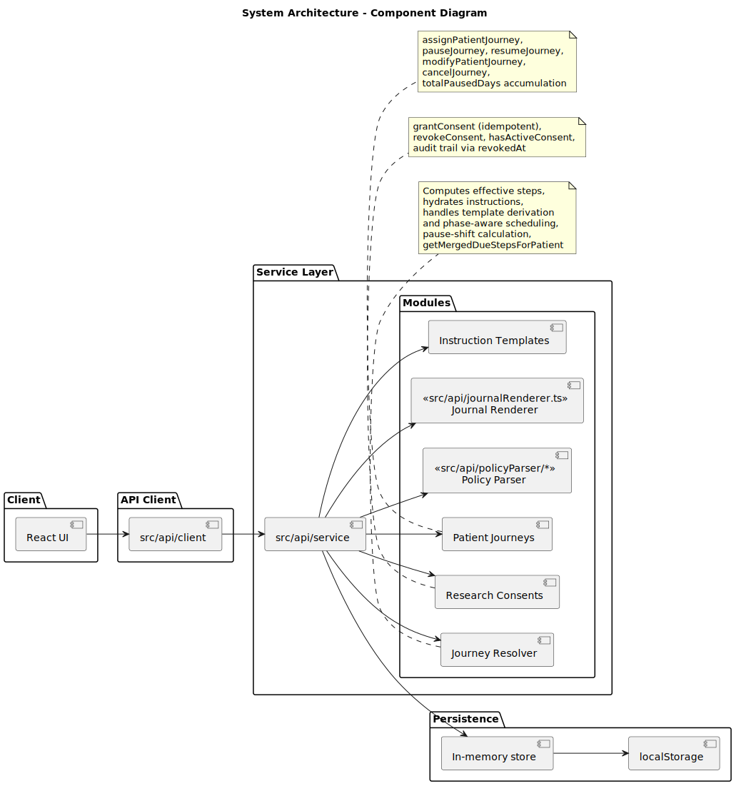

# Design Document - DUK Clinical Triage Demo

## Purpose

This document is the entry point for architecture and design review.

Read in this order:

1. Primary overview diagrams (high-level and conceptual model).
2. Domain deep dives (journeys, policy, journal templating).
3. Reference documentation (field-level details and lifecycle appendices).

The overview diagrams are intentionally incomplete so they remain readable.
Detailed fields and edge-case semantics are moved to deep-dive and reference docs.

## Primary Overview Diagrams

These are the first diagrams to review.

1. `docs/diagrams/architecture-overview.svg`
2. `docs/diagrams/core-entity-relationship-overview.svg`
3. `docs/diagrams/core-data-model-overview.svg`

## Domain Deep Dives

### Journey Domain

Use `docs/design/patient-journey.md` for lifecycle and runtime behavior details.

Primary journey diagrams:

1. `docs/diagrams/patient-journey-lifecycle.svg`
2. `docs/diagrams/journey-scheduling-flow.svg`
3. `docs/diagrams/journey-tabs-sequence.svg`
4. `docs/diagrams/journey-deduplication-flow.svg`
5. `docs/diagrams/pause-resume-sequence.svg`
6. `docs/diagrams/journey-modifications-sequence.svg`
7. `docs/diagrams/form-submission-flow.svg`

### Policy Domain

Use `docs/design/policy.md` for policy evaluation, grammar, and alias-aware scope.

Primary policy diagrams:

1. `docs/diagrams/policy-evaluation-sequence.svg`
2. `docs/diagrams/policy-grammar-model.svg`
3. `docs/diagrams/policy-score-aliasing-flow.svg`

### Journal Templating Domain

Use `docs/design/templating.md` for renderer rules and token whitelist constraints.

Primary templating diagram:

1. `docs/diagrams/journal-generation-sequence.svg`

## Reference Documentation

### Data Model Reference

Use `docs/design/data-model.md` for field-level detail and schema mapping.

Reference diagrams:

1. `docs/diagrams/core-data-model-reference.svg`
2. `docs/diagrams/runtime-model.svg`
3. `docs/diagrams/template-model.svg`
4. `docs/diagrams/runtime-template-bindings-flow.svg`

### Consent Reference

Consent behavior is modeled separately from overview diagrams.

1. `docs/diagrams/research-consent-sequence.svg`
2. `docs/diagrams/research-consent-lifecycle.svg`

## Diagram Index By Intent

- `*-overview`: conceptual and navigation-first diagrams.
- `*-model`: conceptual model structures.
- `*-lifecycle`: state transitions over time.
- `*-sequence`: service interaction chronology.
- `*-flow`: process/activity pipeline.
- `*-reference`: field-level and appendix style detail.

## Implementation Mapping

Core source-of-truth files:

- `src/api/schemas/state.ts`
- `src/api/schemas/patient.ts`
- `src/api/schemas/case.ts`
- `src/api/schemas/journey.ts`
- `src/api/schemas/forms.ts`
- `src/api/service/patientJourneys.ts`
- `src/api/service/journeyResolver.ts`
- `src/api/service/policy.ts`
- `src/api/service/researchConsents.ts`
- `src/api/journalRenderer.ts`
- `src/api/policyParser/parser.ts`

## Glossary

- `PAL`: responsible physician ownership assignment, not a standalone role enum.
- `EpisodeOfCare`: container for journey phases for one clinical problem.
- `PatientJourney`: one phase/program within an episode.
- `Effective step`: computed follow-up step output from resolver logic.
- `Score alias`: stable policy/journal key mapped from raw score fields.
