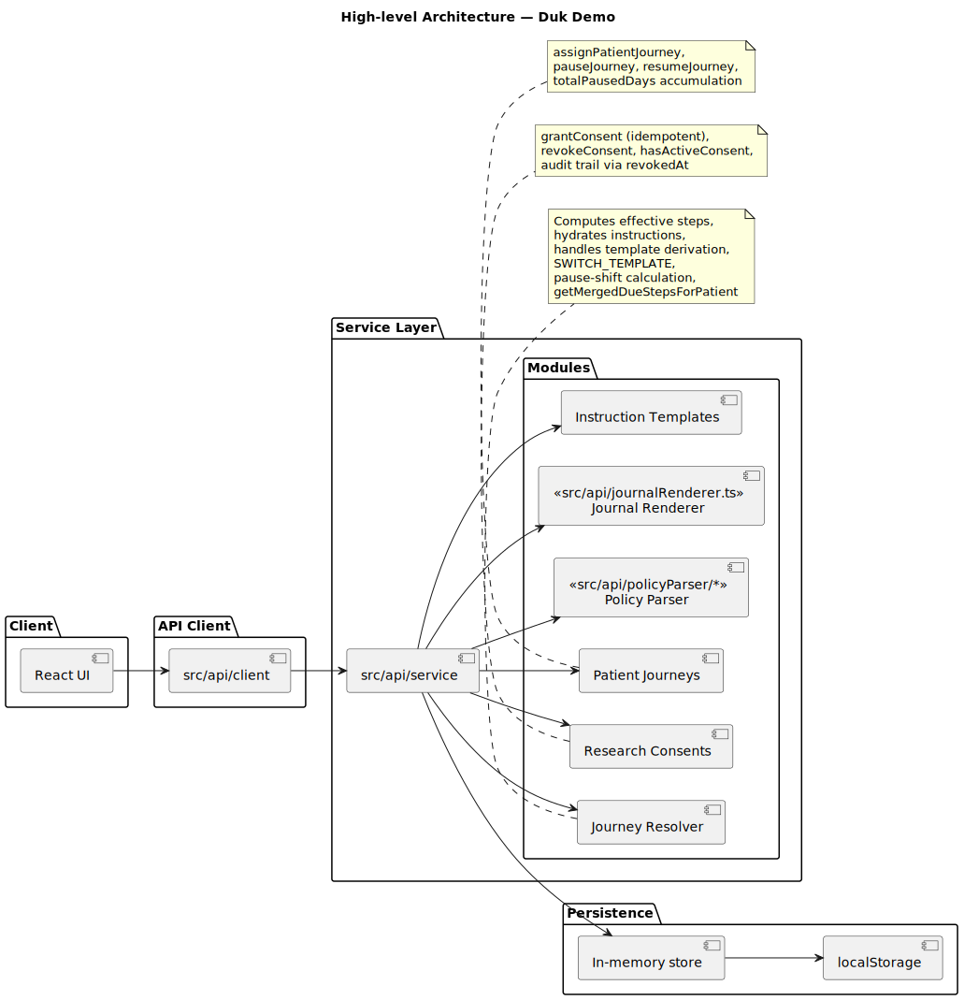
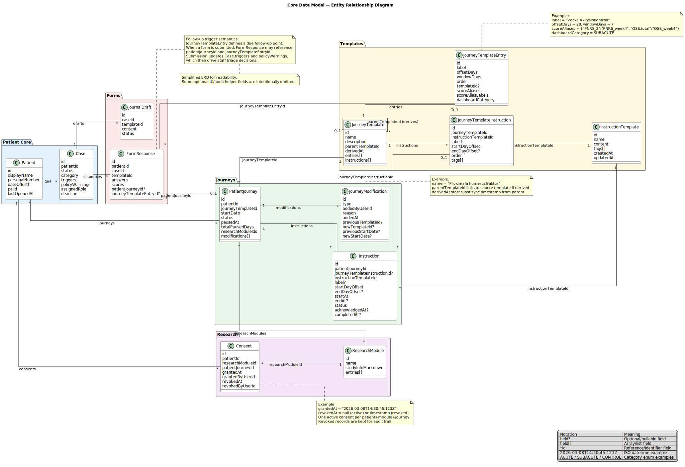
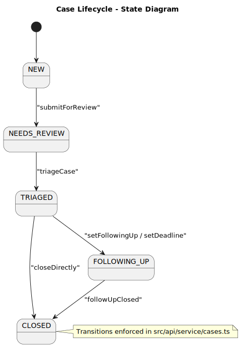
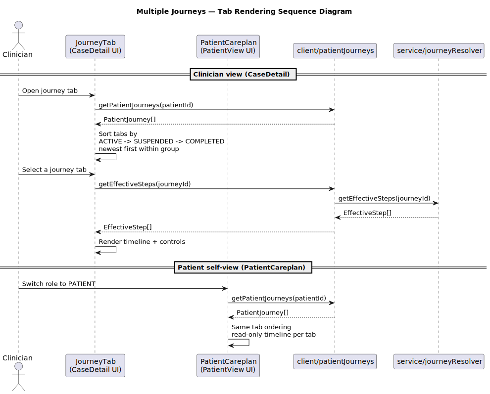
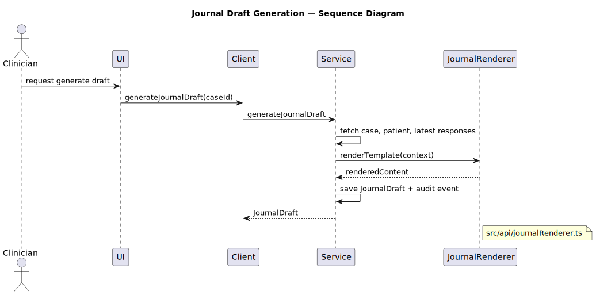
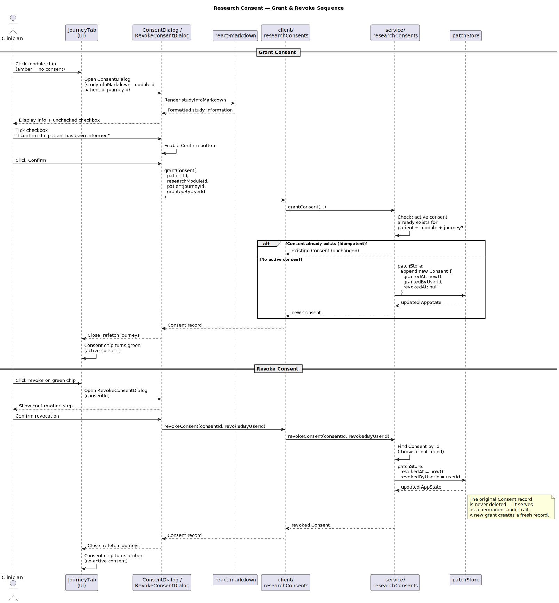
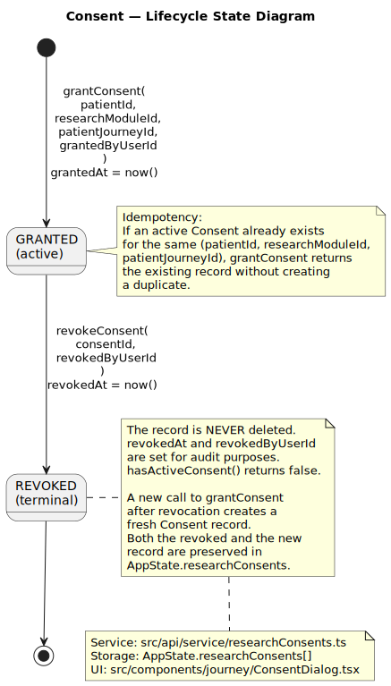

**Design Document — DUK Clinical Triage Demo**

## How To Read This Document

Use this document as a guided tour.

1. Start with architecture and data model.
2. Follow the core clinical flow (dashboard -> case triage -> journey operations).
3. Continue to policy/journal and research consent.
4. Use implementation mapping as a code index.

Diagram reading order in this document:

1. `high-level-architecture.svg`
2. `core-data-model.svg`
3. `case-lifecycle.svg`
4. `dashboard-journey-computation.svg`
5. `patient-journey-lifecycle.svg`
6. `journey-tabs-rendering.svg`
7. `journey-deduplication-flow.svg`
8. `pause-resume-sequence.svg`
9. `journey-modifications-sequence.svg`
10. `form-submission-flow.svg`
11. `triage-policy-sequence.svg`
12. `policy-grammar.svg`
13. `score-aliasing.svg`
14. `journal-generation.svg`
15. `research-consent-sequence.svg`
16. `consent-lifecycle.svg`

## Executive Summary

DUK is a fully client-side React/TypeScript demo of orthopaedic follow-up triage.

- No backend and no authentication.
- All data is fictional and stored in memory + `localStorage`.
- Primary workflow: identify risky patients, triage cases, maintain follow-up journeys, and produce audit-friendly clinical documentation.

## Goals And Constraints

- Tech: React, TypeScript, Vite, MUI, React Hook Form + Zod, i18next.
- Runtime model: async client wrappers over synchronous in-memory services.
- Safety: no `eval`, no dynamic code execution in policy/journal parsing.
- Demo constraints: no real patient data, no network API.

## Roles

- `PATIENT`: self-service forms and care plan view.
- `NURSE`: triage in scope, contact actions, workflow management.
- `DOCTOR`: triage + journal approval.
- `PAL`: doctor capabilities with dedicated queue filters.
- `SECRETARY`: coordination-focused workflow support, including worklist operations.

## System Architecture

What this diagram shows:

- UI calls `src/api/client/*` asynchronous wrappers.
- Client delegates to synchronous service modules.
- Service layer owns business rules and state transitions.
- Persistence is an in-memory singleton mirrored to `localStorage`.

Key takeaway: business logic is centralized in service modules; UI layers remain orchestration-focused.

## Core Data Model

What this diagram shows:

- Primary entities: `Patient`, `Case`, `EpisodeOfCare`, `PatientJourney`, `JourneyTemplate`, `Instruction`, `FormResponse`, `PolicyRule`, `JournalDraft`, `Consent`.
- A patient can have many journeys in parallel.
- Journeys are grouped into episodes and can transition across phase types.
- Consents are append-only audit records with revocation metadata.

Key takeaway: patient follow-up is journey-centric, while triage and messaging are case-centric.

## Clinical Workflow Overview

- Dashboard groups active work by urgency categories.
- Case detail combines forms, journey, triage decisioning, journal, and audit log.
- Triage updates case state and may produce policy warnings.
- Journey logic drives what is due and when.

### Case Lifecycle

What this diagram shows:

- State progression from `NEW` through `CLOSED`.
- Optional direct close path from `TRIAGED`.

Key takeaway: all state transitions are explicit service-layer decisions, not UI-only state.

### Dashboard Due-Step Computation

What this diagram shows:

- Effective steps are computed per journey.
- Pause shifts and modifications are applied before queue construction.
- Parallel journeys are merged with questionnaire deduplication.

Key takeaway: dashboard urgency is computed from current journey state, not static seed data.

## Patient Journeys

A patient may have multiple concurrent `PatientJourney` records (for example two independent programmes running in parallel).

### Journey Lifecycle

What this diagram shows:

- `ACTIVE`, `SUSPENDED`, `COMPLETED` lifecycle.
- Phase progression is modeled by completing one journey and starting the next phase in the same episode.

Key takeaway: suspension is stateful, while clinical progression is represented by explicit phase transitions.

### Parallel Journeys In The UI

What this diagram shows:

- Both clinician (`JourneyTab`) and patient (`PatientCareplan`) views render all journeys in tabs.
- Sorting is consistent: `ACTIVE -> SUSPENDED -> COMPLETED`, newest first per group.

Key takeaway: users navigate whole care history, not just a single active programme.

### Parallel Journey Deduplication

What this diagram shows:

- `getMergedDueStepsForPatient(patientId, date)` deduplicates by questionnaire `templateId`.

Key takeaway: the same questionnaire is shown at most once even when two journeys overlap.

### Pause And Resume

What this diagram shows:

- `pauseJourney` stores `pausedAt` and moves to `SUSPENDED`.
- `resumeJourney` accumulates elapsed days into `totalPausedDays`.
- During suspension, date shift is computed dynamically in resolver logic.

Key takeaway: pause affects schedule calculations without rewriting all step dates.

### Journey Modifications

What this diagram shows:

- `ADD_STEP`, `REMOVE_STEP`, and `CANCEL` modification semantics.
- Episode-phase transitions are handled by `startNextPhase(...)` and tracked with `PatientJourney.transition`.

Key takeaway: modifications are auditable journey history, not destructive edits.

### Journey Cancellation Rules

- If no journey data exists: journey can be deleted.
- If data exists: journey is archived as `COMPLETED` + `CANCEL` modification.
- Form responses are never deleted.

## Form Submission And Data Flow

What this diagram shows:

- Form submission writes `FormResponse`.
- Scores/policy scope are recomputed.
- Case warnings and audit events are updated.

Key takeaway: submission is a pipeline that updates journey, case, and audit surfaces.

## Policy Evaluation

What this diagram shows:

- Triage requests trigger policy scope building and expression evaluation.
- Matched rules produce `policyWarnings` on the case.

What this diagram shows:

- Supported operator classes and precedence model.

What this diagram shows:

- Journey entry score aliases mapped into a stable numeric policy scope.

Key takeaway: policy authoring is expressive but safe, and aliasing keeps rule identifiers stable over time.

## Journal Generation

What this diagram shows:

- Journal draft generation pulls patient/case/form context.
- Content is rendered by a safe renderer and persisted with audit context.

Key takeaway: journal generation is deterministic, templated, and auditable.

## Research Consent

What this diagram shows:

- Consent grant requires acknowledgement in dialog UI.
- Grant is idempotent per patient/module/journey.
- Revocation sets metadata and preserves history.

What this diagram shows:

- State-level model of active vs revoked consent records.

Key takeaway: consent storage is intentionally append-only for auditability.

## Supporting UX Features

- Global search for clinicians (`/patients/:id` navigation).
- Contact action shortcuts for `SEEK_CONTACT`/`NOT_OPENED` triggers.
- Print-friendly journal view (top bar and side nav hidden in print mode).
- Shared `ConfirmDialog` for destructive actions.
- Paginated patient lists with resilient page clamping.

## Implementation Mapping

Core code entry points:

- Enums: `../src/api/schemas/enums.ts`
- Case services: `../src/api/service/cases.ts`
- Journey resolver: `../src/api/service/journeyResolver.ts`
- Journey lifecycle services: `../src/api/service/patientJourneys.ts`
- Policy parser: `../src/api/policyParser/parser.ts`
- Policy service: `../src/api/service/policy.ts`
- Journal renderer: `../src/api/journalRenderer.ts`
- Research consent service: `../src/api/service/researchConsents.ts`
- Case journey UI: `../src/components/case/JourneyTab/index.tsx`
- Patient care plan UI: `../src/components/patientView/PatientCareplan/main.tsx`

Focused docs:

- Journey deep dive: `design/patient-journey.md`
- Policy deep dive: `design/policy.md`

## Gaps And Future Enhancements

- Add explicit Case -> Journey linkage only if business rules require one-to-one coupling.
- Consider richer audit filtering (date range, actor, action type).
- Consider per-step completion overlays in patient care plan timeline.
- Keep diagram and docs synchronized when changing service contracts or state transitions.

## Diagram Sources

All diagrams are authored in `docs/diagrams/*.puml` and rendered to SVG via `npm run diagrams:render`.
