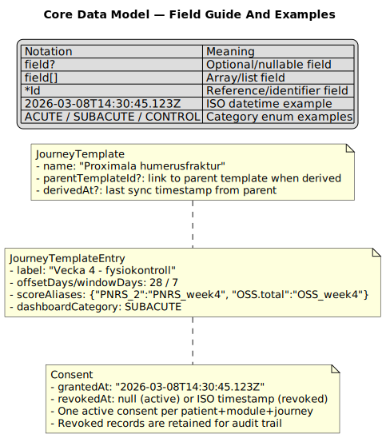

**Data Model — Detailed Fields**

This document expands the core entities with field-level detail and references to the canonical Zod schemas in the codebase.

The ERD above is intentionally compact. For examples and clarifications of non-intuitive field names, see:

Patient (src/api/schemas/patient.ts)

- id: string (uuid)
- displayName: string
- personalNumber: string | null
- dateOfBirth: string (ISO)
- palId: string | null (user id of PAL)
- lastOpenedAt: string | null (ISO)
- createdAt: string (ISO)

Case (src/api/schemas/case.ts)

- id: string
- patientId: string (FK → Patient.id)
- episodeId: string | undefined (FK → EpisodeOfCare.id)
- status: enum (NEW, NEEDS_REVIEW, TRIAGED, FOLLOWING_UP, CLOSED)
- category: enum (ACUTE, SUBACUTE, CONTROL)
- triggers: string[] (named trigger keys)
- policyWarnings: {ruleId, ruleName, severity, triggeredValues, expression}[]
- triageDecision: {contactMode, careRole, assignmentMode, assignedUserId?, dueAt?, note?} | undefined
- bookings: Booking[] | undefined
- reviews: ClinicalReview[]
- internalNote, patientMessage, deadline, formSeriesId: string | undefined
- createdAt, lastActivityAt: string (ISO)
- closedAt: string | null | undefined

PatientJourney (src/api/schemas/journey.ts)

- id: string
- episodeId: string
- patientId: string
- journeyTemplateId: string
- phaseType: enum (REFERRAL, INTAKE, FOLLOWUP, WAITING_LIST, POST_OP, MONITORING, DISCHARGE)
- phaseLabel: string | undefined
- startDate: string (YYYY-MM-DD)
- joinedAt: string (YYYY-MM-DD; late enrollment anchor)
- transition: JourneyPhaseTransition | undefined
- status: enum (ACTIVE, SUSPENDED, COMPLETED)
- pausedAt: string | null (ISO; set when SUSPENDED, cleared on resume)
- totalPausedDays: number (accumulated whole-day pauses from all previous pause/resume cycles)
- researchModuleIds: string[]
- modifications: JourneyModification[]
- recurringCompletions: RecurringCompletion[]
- createdAt, updatedAt: string (ISO)

EpisodeOfCare (src/api/schemas/journey.ts)

- id: string
- patientId: string
- label: string
- clinicalArea: string | undefined
- status: enum (OPEN, COMPLETED, DISCHARGED)
- openedAt: string (ISO)
- closedAt: string | null (ISO)
- responsibleUserId: string | undefined
- primaryCaseId: string | undefined
- createdAt, updatedAt: string (ISO)

JourneyTemplateEntry

- id: string
- label: string
- templateId: string | undefined (questionnaire template; optional for instruction-only steps)
- order: number
- offsetDays: number
- windowDays: number
- scoreAliases: Record<string, string> (raw score key → semantic alias)
- scoreAliasLabels: Record<string, string> (alias → human label)
- stepKey: string | undefined
- dashboardCategory: enum (ACUTE, SUBACUTE, CONTROL)
- recurrenceIntervalDays: number | undefined
- reviewTypes: ReviewType[] | undefined
- icon: string | undefined

JourneyTemplateInstruction

- id: string
- journeyTemplateId: string (FK → JourneyTemplate.id)
- instructionTemplateId: string (FK → InstructionTemplate.id)
- label: string | undefined
- startDayOffset: number
- endDayOffset: number | undefined
- order: number
- tags: string[]

Instruction

- id: string
- patientJourneyId: string (FK → PatientJourney.id)
- journeyTemplateInstructionId: string | undefined
- instructionTemplateId: string (FK → InstructionTemplate.id)
- label: string | undefined
- startDayOffset: number
- endDayOffset: number | undefined
- startAt: string (ISO)
- endAt: string | null (ISO)
- status: enum (ACTIVE, ACKNOWLEDGED, COMPLETED, CANCELLED)
- acknowledgedAt, completedAt: string | null (ISO)
- acknowledgedByUserId, completedByUserId: string | null
- tags: string[]
- createdAt, updatedAt: string (ISO)

JourneyTemplate

- id: string
- name: string
- description: string | undefined
- entries: JourneyTemplateEntry[]
- parentTemplateId: string | undefined (FK → parent JourneyTemplate.id for derived templates)
- derivedAt: string | undefined (ISO; timestamp of last sync from parent)
- referenceDateLabel: string
- createdAt: string (ISO)

InstructionTemplate (src/api/schemas/journey.ts) — NEW

- id: string
- name: string
- content: string (Markdown content shown to clinicians and patients)
- tags: string[] (e.g., ["physio", "shoulder", "post-op"])
- createdAt: string (ISO)
- updatedAt: string (ISO)

JourneyModification (embedded in PatientJourney.modifications[])

- id: string
- type: enum (ADD_STEP, REMOVE_STEP, CANCEL)
- addedByUserId: string
- reason: string
- addedAt: string (ISO)
- entry: JourneyTemplateEntry | undefined (for ADD_STEP)
- stepId: string | undefined (for REMOVE_STEP)
- mergedFromJourneyId: string | undefined (audit trail for parallel-journey merge conflicts)

FormResponse (src/api/schemas/forms.ts)

- id: string
- patientId: string
- templateId: string
- caseId: string | null
- answers: Record<string, number | string | boolean>
- scores: Record<string, number> (computed using scoringRules)
- submittedAt: string (ISO)
- patientJourneyId: string | undefined (FK → PatientJourney.id; present when submitted via a journey step)
- journeyTemplateEntryId: string | undefined (FK → JourneyTemplateEntry.id; present when submitted via a journey step)
- occurrenceIndex: number | undefined (which recurrence instance; present for recurring steps)

QuestionnaireTemplate (src/api/schemas/questionnaire.ts)

- id: string
- questions: {id, type, label, options?}[]
- scoringRules: {id, expression, aggregation}[]

JournalDraft (src/api/schemas/journal.ts)

- id, caseId, templateId
- content: string
- status: enum (DRAFT, APPROVED)
- createdByUserId, createdAt, updatedAt

PolicyRule (src/api/schemas/policy.ts)

- id, name, expression (string), severity (LOW/MEDIUM/HIGH), enabled, createdAt

AuditEvent (src/api/schemas/audit.ts)

- id, caseId, userId, userRole, action, details (free-form), timestamp

ResearchModule (src/api/schemas/journey.ts)

- id: string
- name: string
- studyInfoMarkdown: string (Markdown rendered in ConsentDialog to inform the patient/clinician before granting consent)
- entries: ResearchModuleEntry[] (questionnaire steps overlaid on the journey timeline)

Consent (src/api/schemas/journey.ts)

- id: string (uuid)
- patientId: string
- researchModuleId: string
- patientJourneyId: string
- grantedAt: string (ISO)
- grantedByUserId: string
- revokedAt: string | null (ISO; null = still active)
- revokedByUserId: string | null
- withdrawalReason: string | null

All `Consent` records are stored in `AppState.researchConsents`. A revoked consent is never deleted — it stays as a permanent audit trail and a new grant creates a fresh record.

Notes

- The codebase stores journeys by `patientId` and the UI renders all journeys in tabbed views sorted ACTIVE → SUSPENDED → COMPLETED. There is no explicit Case→PatientJourney foreign key.
- `getMergedDueStepsForPatient(patientId, date)` deduplicates due steps across parallel journeys by questionnaire `templateId` for dashboard display.
- `InstructionTemplate` entities are stored in `AppState.instructionTemplates` and referenced from `JourneyTemplateInstruction` and `Instruction`.
- `JourneyTemplate.parentTemplateId` tracks derivation lineage; `derivedAt` marks the last sync point for `computeParentDiff`.
- `getEffectiveSteps` only resolves follow-up steps. Instruction rendering uses the dedicated instruction APIs and persisted `Instruction` records.
- Effective step dates are shifted by `totalPausedDays + currentPauseDays` dynamically in `getEffectiveSteps`; no dates are rewritten to the store during display.
- `cancelJourney` uses `FormResponse.patientJourneyId` and `PatientJourney.recurringCompletions` to determine whether a journey has recorded data and should be archived (→ `COMPLETED` + `CANCEL` modification) vs. deleted entirely.
