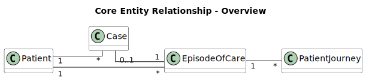
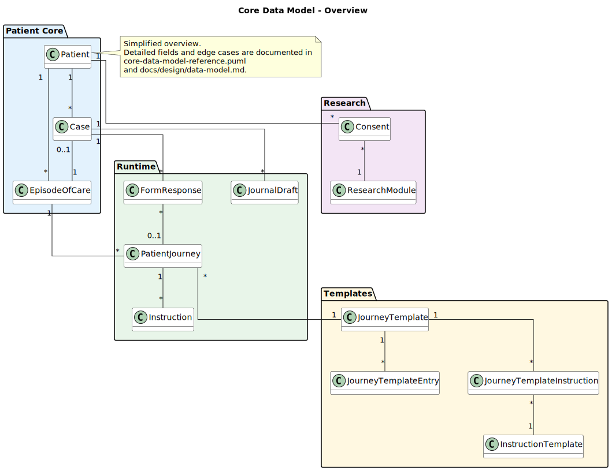
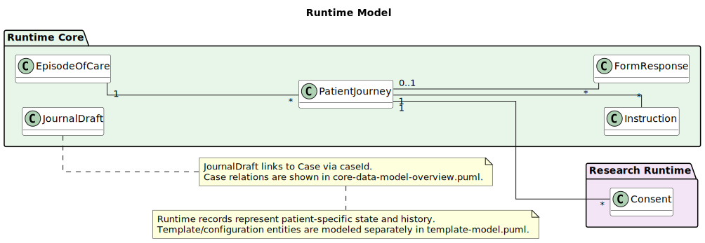
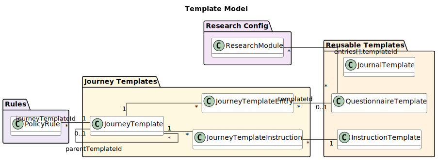
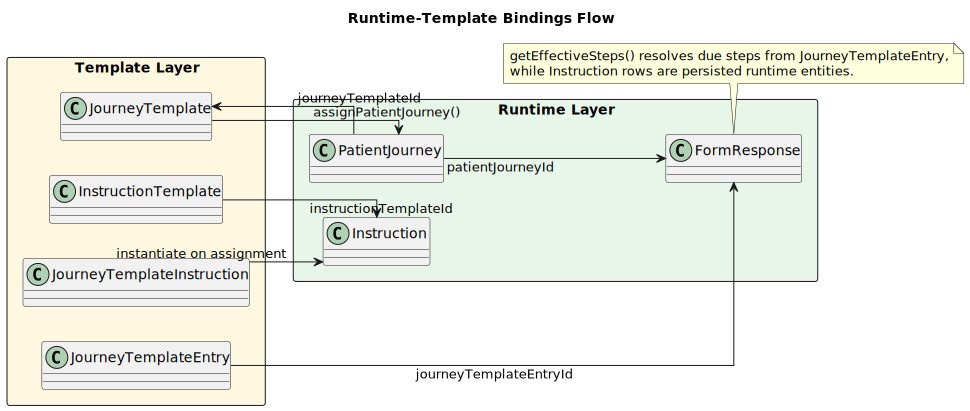
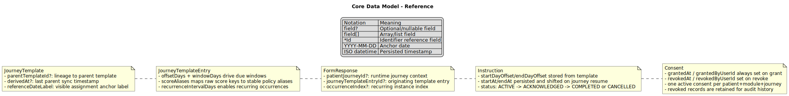
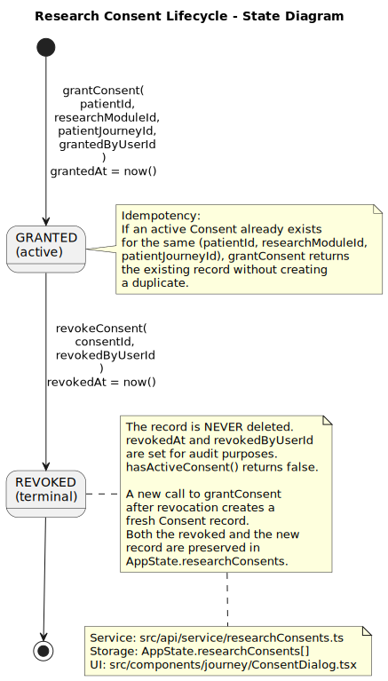

# Data Model - Conceptual and Reference Guide

This page explains the split data-model documentation layers.

1. Conceptual overview: tiny relationship map for fast orientation.
2. Broader overview: cross-domain entity map for architecture review.
3. Reference detail: field-level clarifications and non-obvious semantics.

## Conceptual Overview

Use this first to understand the kernel:

- `Patient`
- `Case`
- `EpisodeOfCare`
- `PatientJourney`

This diagram is intentionally minimal.

## Broader Model Overview

This overview adds runtime, template, and research entities while staying readable.

## Supporting Model Views

These views answer different questions:

- Runtime model: what patient-specific records are persisted during operation.
- Template model: what reusable configuration records define behavior.
- Runtime-template bindings: how assignment and resolution map templates to runtime records.

## Field-Level Reference

Field-heavy details stay here instead of in overview diagrams.

### Patient (`src/api/schemas/patient.ts`)

- `id: string`
- `displayName: string`
- `personalNumber: string | null`
- `dateOfBirth: string`
- `palId?: string`
- `lastOpenedAt: string | null`
- `createdAt: string`

### Case (`src/api/schemas/case.ts`)

- `id: string`
- `patientId: string`
- `episodeId?: string`
- `status: NEW | NEEDS_REVIEW | TRIAGED | FOLLOWING_UP | CLOSED`
- `category: ACUTE | SUBACUTE | CONTROL`
- `triggers: TriggerType[]`
- `policyWarnings: PolicyWarning[]`
- `triageDecision?: {...}`
- `bookings?: Booking[]`
- `reviews: ClinicalReview[]`
- `createdAt: string`
- `lastActivityAt: string`
- `closedAt?: string | null`

### EpisodeOfCare (`src/api/schemas/journey.ts`)

- `id: string`
- `patientId: string`
- `label: string`
- `status: OPEN | COMPLETED | DISCHARGED`
- `openedAt: string`
- `closedAt: string | null`
- `responsibleUserId?: string`
- `primaryCaseId?: string`

### PatientJourney (`src/api/schemas/journey.ts`)

- `id: string`
- `episodeId: string`
- `patientId: string`
- `journeyTemplateId: string`
- `phaseType: REFERRAL | INTAKE | FOLLOWUP | WAITING_LIST | POST_OP | MONITORING | DISCHARGE`
- `phaseLabel?: string`
- `startDate: string` (`YYYY-MM-DD`)
- `joinedAt: string`
- `transition?: JourneyPhaseTransition`
- `status: ACTIVE | SUSPENDED | COMPLETED`
- `responsiblePhysicianUserId?: string | null`
- `pausedAt: string | null`
- `totalPausedDays: number`
- `researchModuleIds: string[]`
- `modifications: JourneyModification[]`
- `recurringCompletions: RecurringCompletion[]`

### JourneyTemplate and entries (`src/api/schemas/journey.ts`)

- `JourneyTemplate.entries: JourneyTemplateEntry[]`
- `JourneyTemplate.instructions: JourneyTemplateInstruction[]`
- `JourneyTemplate.parentTemplateId?: string`
- `JourneyTemplate.derivedAt?: string`
- `JourneyTemplate.referenceDateLabel: string`

- `JourneyTemplateEntry.templateId?: string`
- `JourneyTemplateEntry.offsetDays: number`
- `JourneyTemplateEntry.windowDays: number`
- `JourneyTemplateEntry.scoreAliases: Record<string, string>`
- `JourneyTemplateEntry.scoreAliasLabels: Record<string, string>`
- `JourneyTemplateEntry.recurrenceIntervalDays?: number`

### Instruction model (`src/api/schemas/journey.ts`)

- `InstructionTemplate`: reusable markdown content and tags.
- `JourneyTemplateInstruction`: scheduling binding from journey template to instruction template.
- `Instruction`: runtime persisted instruction instance with status and timestamps.

Instruction status values:

- `ACTIVE`
- `ACKNOWLEDGED`
- `COMPLETED`
- `CANCELLED`

### FormResponse (`src/api/schemas/forms.ts`)

- `id: string`
- `patientId: string`
- `templateId: string`
- `caseId?: string`
- `answers: Record<string, string | number | boolean>`
- `scores: Record<string, number>`
- `submittedAt: string`
- `patientJourneyId?: string`
- `journeyTemplateEntryId?: string`
- `occurrenceIndex?: number`

### Research model (`src/api/schemas/journey.ts`)

- `ResearchModule`: configuration of study metadata and entry overlays.
- `Consent`: audit record keyed by patient, module, and journey.

Consent records are append-only in `AppState.researchConsents`; revocation timestamps the record, it is not deleted.

## AppState Top-Level Collections

Source: `src/api/schemas/state.ts`.

- `patients[]`
- `cases[]`
- `episodesOfCare[]`
- `patientJourneys[]`
- `journeyTemplates[]`
- `instructionTemplates[]`
- `instructions[]`
- `formResponses[]`
- `journalDrafts[]`
- `journalTemplates[]`
- `policyRules[]`
- `researchModules[]`
- `researchConsents[]`

## Notes

- There is no direct `Case -> PatientJourney` foreign key.
- Dashboard due steps are merged across journeys by questionnaire `templateId` in `getMergedDueStepsForPatient(...)`.
- Effective step dates are computed using pause-shift logic; they are not generally rewritten for display operations.
