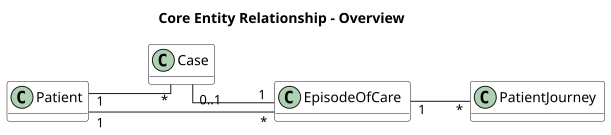
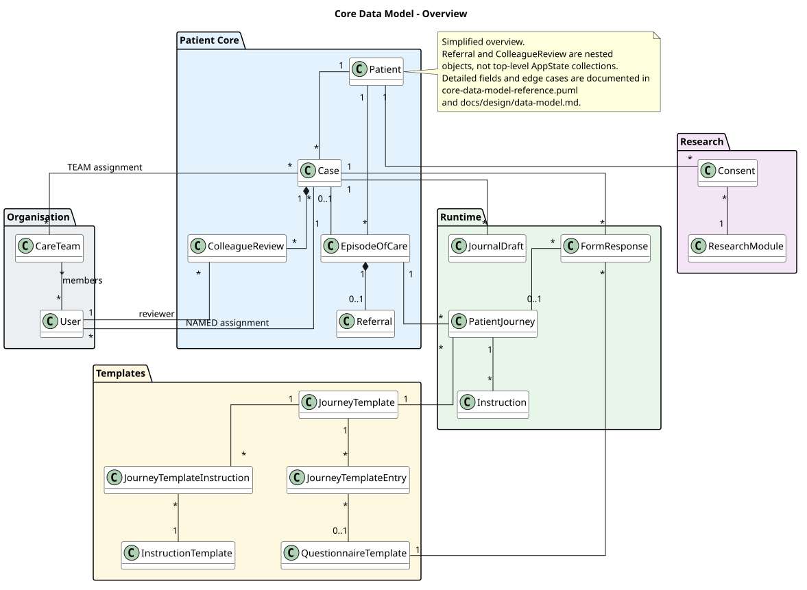
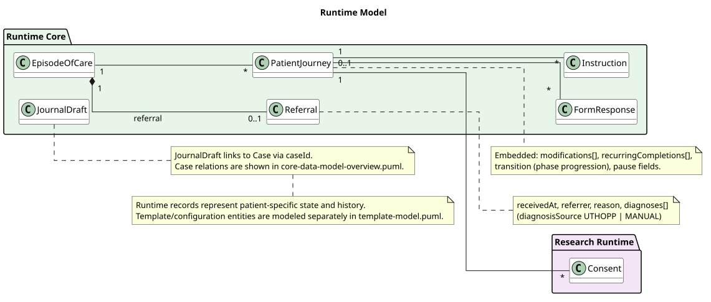
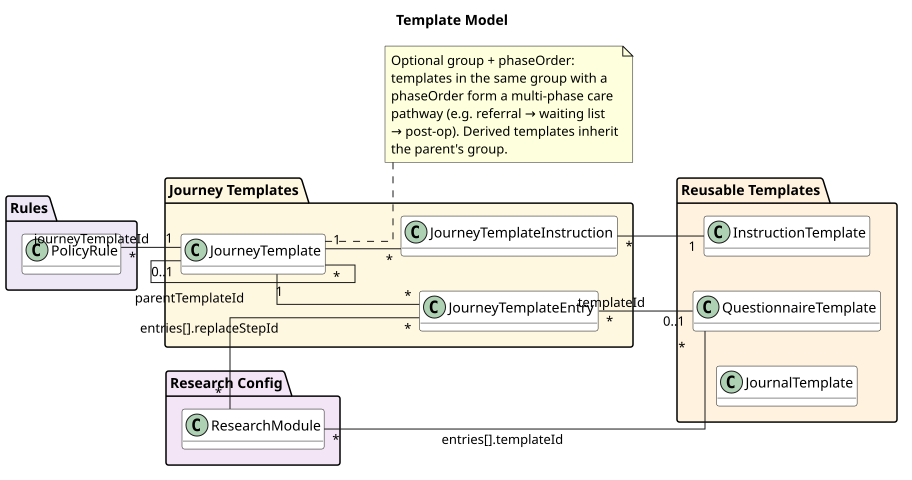
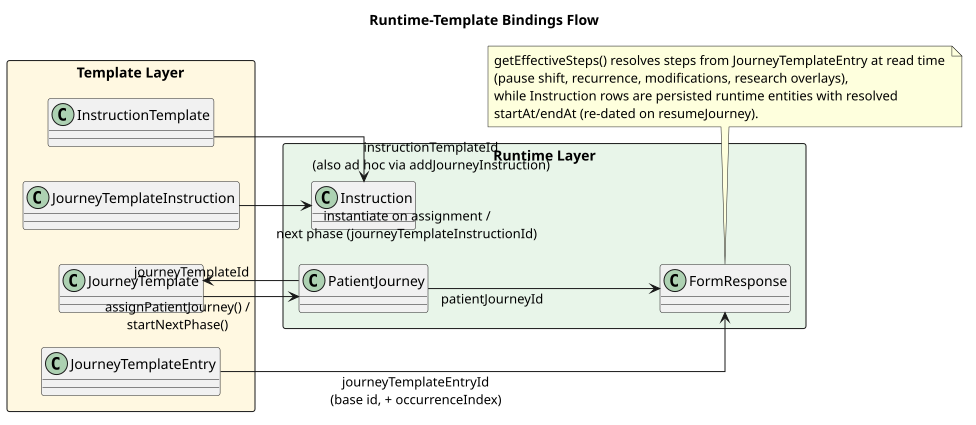
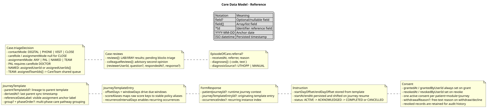
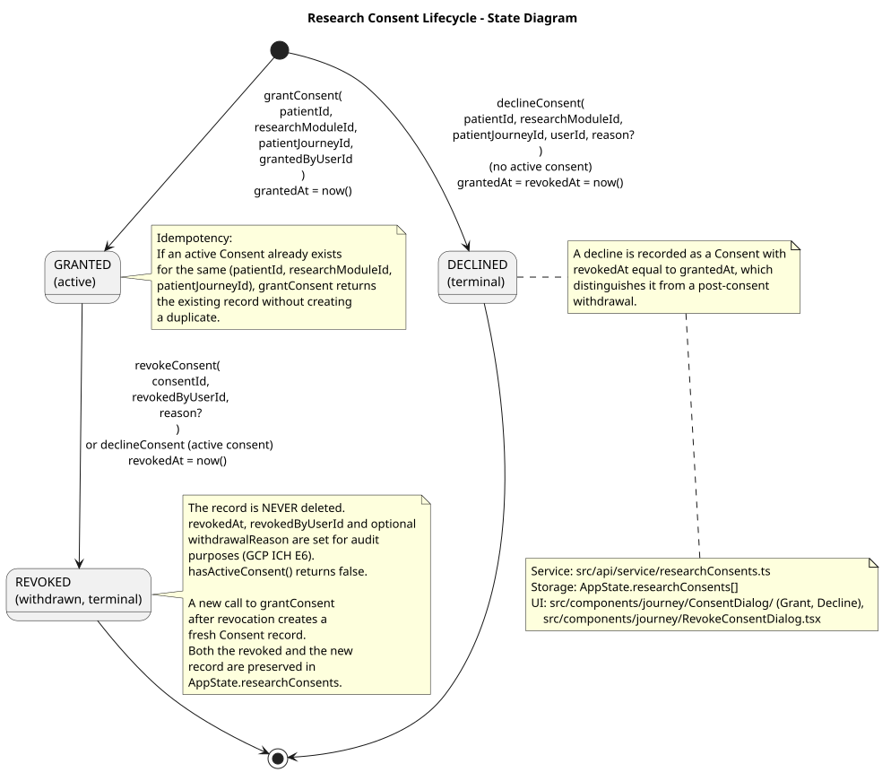

# Data Model - Conceptual and Reference Guide

This page explains the split data-model documentation layers.

1. Conceptual overview: tiny relationship map for fast orientation.
2. Broader overview: cross-domain entity map for architecture review.
3. Reference detail: field-level clarifications and non-obvious semantics.

## Conceptual Overview

Use this first to understand the kernel:

- `Patient`
- `Case`
- `EpisodeOfCare`
- `PatientJourney`

This diagram is intentionally minimal.

## Broader Model Overview

This overview adds organisation (users, care teams), runtime, template, and research entities while staying readable.

## Supporting Model Views

These views answer different questions:

- Runtime model: what patient-specific records are persisted during operation.
- Template model: what reusable configuration records define behavior.
- Runtime-template bindings: how assignment and resolution map templates to runtime records.

## Field-Level Reference

Field-heavy details stay here instead of in overview diagrams.

### Patient (`src/api/schemas/patient.ts`)

- `id: string`
- `displayName: string`
- `personalNumber: string`
- `dateOfBirth: string`
- `palId?: string`
- `lastOpenedAt?: string` (set by `patientOpenedApp(...)`)
- `createdAt: string`

### Case (`src/api/schemas/case.ts`)

- `id: string`
- `patientId: string`
- `episodeId?: string`
- `status: NEW | NEEDS_REVIEW | TRIAGED | FOLLOWING_UP | CLOSED`
  - Valid transitions (`VALID_TRANSITIONS` in `src/api/service/cases.ts`):
    - `NEW → NEEDS_REVIEW` — patient submitted a form or sought contact (`submitFormResponse`, `seekContact`)
    - `NEW → TRIAGED` — clinician acts directly; patient has not opened the app (`triageCase`)
    - `NEW → CLOSED` — clinician closes directly (`triageCase` with contactMode = CLOSE)
    - `NEEDS_REVIEW → TRIAGED` — clinician reviews and triages (`triageCase`)
    - `NEEDS_REVIEW → CLOSED` — clinician closes directly (contactMode = CLOSE)
    - `TRIAGED → FOLLOWING_UP` — nurse/secretary starts working the worklist item (`advanceCaseStatus`)
    - `TRIAGED → CLOSED` — nurse/secretary completes the worklist item directly (`completeWorklistCase`)
    - `FOLLOWING_UP → CLOSED` — nurse/secretary marks the worklist item done (`completeWorklistCase`)
  - `triageCase` is blocked while LAB/XRAY `reviews` are pending.
  - **Note:** `TRIAGED` and `FOLLOWING_UP` transitions are owned by the Worklist, not the TriageTab. The TriageTab shows a read-only summary of the triage decision for these statuses.
- `category: ACUTE | SUBACUTE | CONTROL`
- `triggers: TriggerType[]`
- `policyWarnings: PolicyWarning[]`
- `createdByUserId: string`, `triagedByUserId?: string`
- `assignedRole?: Role`, `assignedUserId?: string` (current owner; set on triage or by `claimCaseAssignment`)
- `nextStep?: NextStep`, `deadline?: string`, `internalNote?: string`, `patientMessage?: string` (derived from/legacy alongside `triageDecision`)
- `triageDecision?: TriageDecision`
  - `contactMode: DIGITAL | PHONE | VISIT | CLOSE`
  - `careRole: DOCTOR | NURSE | PHYSIO | null` (null for CLOSE)
  - `assignmentMode: ANY | PAL | NAMED | TEAM | null` (null for CLOSE; PAL requires careRole DOCTOR)
  - `assignedUserId?` / `assignedUserIds?: string[]` — NAMED only; one person owns the task directly, several people all see it as theirs and can claim it
  - `assignedTeamIds?: string[]` — required for TEAM; task goes to the teams' shared queue
  - `dueAt?`, `note?`
- `bookings?: Booking[]` (status `PENDING | SCHEDULED | COMPLETED | CANCELLED`, completion metadata)
- `reviews: ClinicalReview[]` (LAB/XRAY result reviews, outcome `OK | UNCERTAIN | PROBLEM`)
- `colleagueReviews: ColleagueReview[]` — advisory second opinion requested from a named colleague (`requestedByUserId`, `reviewerUserId`, `question`, `respondedAt`, `response`); never blocks triage
- `scheduledAt: string`
- `createdAt: string`
- `lastActivityAt: string`
- `closedAt?: string | null`

Contact attempts (`CONTACTED | REMINDER_SENT | CALL_ATTEMPT`) are not case fields; they are logged as `AuditEvent`s via `logContactEvent(...)`.

### Users and care teams (`src/api/schemas/users.ts`, `src/api/schemas/team.ts`)

- `User`: `id`, `name`, `role: PATIENT | NURSE | DOCTOR | SECRETARY`
- `CareTeam`: `id`, `name`, `memberUserIds: string[]` — a clinical team (e.g. "Höft") sharing a task queue
- `isCaseAssignedToUser(...)` (`src/api/service/teams.ts`) treats a case as the user's when claimed by them, named in `assignedUserIds`, or sent (TEAM) to a team they belong to.

Login is handled outside `AppState` by a replaceable auth adapter (`src/auth/`); the demo uses `fakeAuthProvider`, which maps login options onto seeded users and keeps the session in `localStorage`.

### EpisodeOfCare (`src/api/schemas/journey.ts`)

- `id: string`
- `patientId: string`
- `label: string`
- `clinicalArea?: string`
- `status: OPEN | COMPLETED | DISCHARGED`
- `openedAt: string`
- `closedAt: string | null`
- `responsibleUserId?: string`
- `primaryCaseId?: string`
- `referral?: Referral`
  - `receivedAt`, `referrer` (referring unit), `reason` (free text)
  - `diagnoses: { code, text }[]`, `diagnosisSource?: UTHOPP | MANUAL`
  - Diagnoses are not entered in the app; they arrive via a simulated "uthopp" (context launch from the journal system), see `setReferralDiagnoses(...)`.
- `createdAt: string`, `updatedAt: string`

### PatientJourney (`src/api/schemas/journey.ts`)

- `id: string`
- `episodeId: string`
- `patientId: string`
- `journeyTemplateId: string`
- `phaseType: REFERRAL | INTAKE | FOLLOWUP | WAITING_LIST | POST_OP | MONITORING | DISCHARGE`
- `phaseLabel?: string`
- `startDate: string` (`YYYY-MM-DD`)
- `joinedAt: string`
- `transition?: JourneyPhaseTransition`
- `status: ACTIVE | SUSPENDED | COMPLETED`
- `responsiblePhysicianUserId?: string | null`
- `pausedAt: string | null`
- `totalPausedDays: number`
- `researchModuleIds: string[]`
- `modifications: JourneyModification[]`
- `recurringCompletions: RecurringCompletion[]`

### JourneyTemplate and entries (`src/api/schemas/journey.ts`)

- `JourneyTemplate.entries: JourneyTemplateEntry[]`
- `JourneyTemplate.instructions: JourneyTemplateInstruction[]`
- `JourneyTemplate.parentTemplateId?: string`
- `JourneyTemplate.derivedAt?: string`
- `JourneyTemplate.referenceDateLabel: string`
- `JourneyTemplate.group?: string` — editor grouping, e.g. "Frakturer"
- `JourneyTemplate.phaseOrder?: number` — 1-based position within the group's multi-phase care pathway

- `JourneyTemplateEntry.templateId?: string`
- `JourneyTemplateEntry.offsetDays: number`
- `JourneyTemplateEntry.windowDays: number`
- `JourneyTemplateEntry.stepKey?: string`
- `JourneyTemplateEntry.dashboardCategory: ACUTE | SUBACUTE | CONTROL`
- `JourneyTemplateEntry.scoreAliases: Record<string, string>`
- `JourneyTemplateEntry.scoreAliasLabels: Record<string, string>`
- `JourneyTemplateEntry.recurrenceIntervalDays?: number`
- `JourneyTemplateEntry.reviewTypes?: (LAB | XRAY)[]`

### Instruction model (`src/api/schemas/journey.ts`)

- `InstructionTemplate`: reusable markdown content and tags.
- `JourneyTemplateInstruction`: scheduling binding from journey template to instruction template.
- `Instruction`: runtime persisted instruction instance with status and timestamps.

Instruction status values:

- `ACTIVE`
- `ACKNOWLEDGED`
- `COMPLETED`
- `CANCELLED` (with `cancelReason: LATE_JOIN | MANUAL`)

### FormResponse (`src/api/schemas/forms.ts`)

- `id: string`
- `patientId: string`
- `templateId: string`
- `caseId?: string`
- `answers: Record<string, string | number | boolean>`
- `scores: Record<string, number>`
- `submittedAt: string`
- `patientJourneyId?: string`
- `journeyTemplateEntryId?: string`
- `occurrenceIndex?: number`

### JournalDraft (`src/api/schemas/journal.ts`)

- `id`, `caseId`, `templateId?`, `content`
- `status: DRAFT | APPROVED` (`approvedByUserId?`, `approvedAt?`)
- `deleteJournalDraft(...)` removes the draft from `AppState` and records a `JOURNAL_DRAFT_DELETED` audit event.

### Research model (`src/api/schemas/journey.ts`)

- `ResearchModule`: configuration of study metadata and entry overlays.
- `Consent`: audit record keyed by patient, module, and journey (`withdrawalReason` optional free text).

Consent records are append-only in `AppState.researchConsents`; revocation timestamps the record, it is not deleted.

## AppState Top-Level Collections

Source: `src/api/schemas/state.ts`.

Metadata:

- `schemaVersion` — persisted shape version (`CURRENT_SCHEMA_VERSION = 18` in `src/api/schemaVersion.ts`)
- `demoDataVersion` — bundled demo content version (`CURRENT_DEMO_DATA_VERSION`)
- `seedAnchorDate?` — local date the demo timeline is anchored to

Collections:

- `users[]`
- `careTeams[]`
- `patients[]`
- `cases[]`
- `episodesOfCare[]`
- `patientJourneys[]`
- `journeyTemplates[]`
- `instructionTemplates[]`
- `instructions[]`
- `formResponses[]`
- `questionnaireTemplates[]`
- `formSeries[]`
- `auditEvents[]`
- `journalDrafts[]`
- `journalTemplates[]`
- `policyRules[]`
- `researchModules[]`
- `researchConsents[]`

## Persistence and Bootstrapping

- `AppState` is held in an in-memory store and written through to `localStorage` key `duk_app_state` (`src/api/storage.ts`). Journey-editor undo snapshots use a separate key (`duk_undo_history`).
- On startup `initializeStoreFromRaw(...)` (`src/api/bootstrap.ts`) runs `runMigrations(...)` (`src/api/migrations.ts`), which steps the stored state forward one version at a time and reports downgrade / no-path / invalid errors.
- Empty stores, or stores with `demoDataVersion < CURRENT_DEMO_DATA_VERSION`, are replaced by a fresh seed (`buildMinimalSeed`).
- Otherwise `reanchorDemoState(...)` shifts every date by the days elapsed since `seedAnchorDate`, so demo examples keep their position relative to today. States without an anchor are left unchanged.

## Notes

- There is no direct `Case -> PatientJourney` foreign key.
- Responsible physician (PAL) for a case resolves journey `responsiblePhysicianUserId` → episode `responsibleUserId` → patient `palId` (`src/api/service/palOwnership.ts`); an explicit `null` on the journey stops the fallback.
- Dashboard due steps are merged across journeys by questionnaire `templateId` in `getMergedDueStepsForPatient(...)`.
- Effective step dates are computed using pause-shift logic; they are not generally rewritten for display operations.
