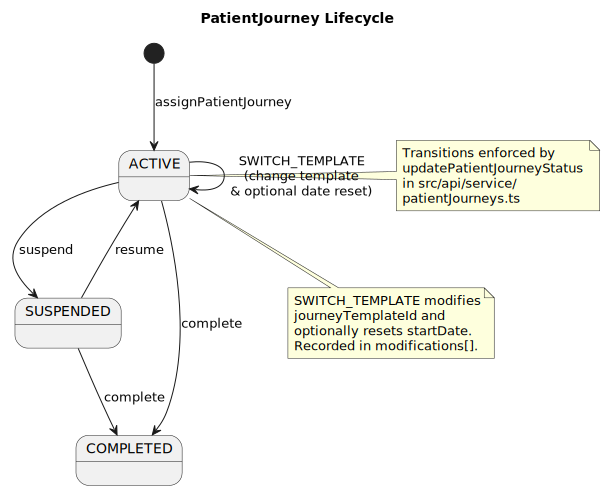
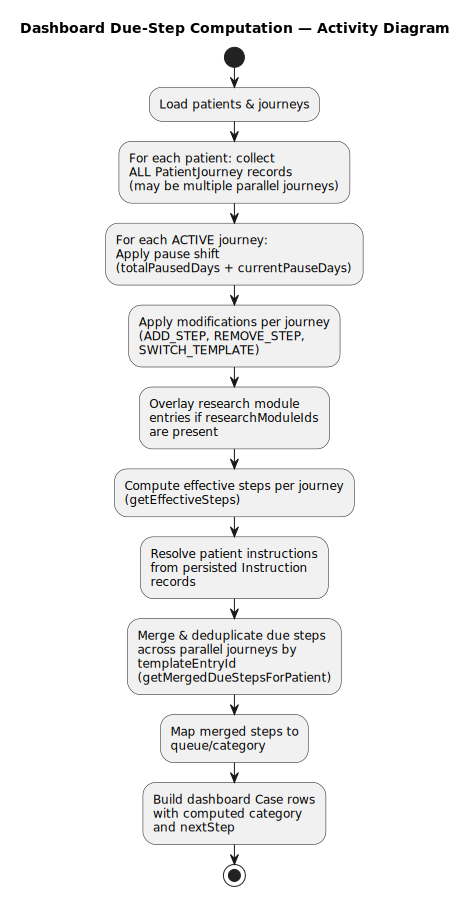
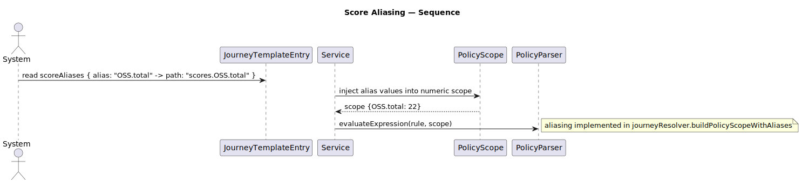
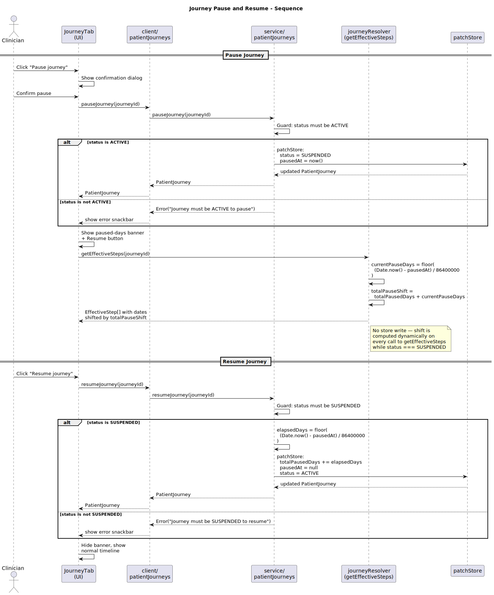
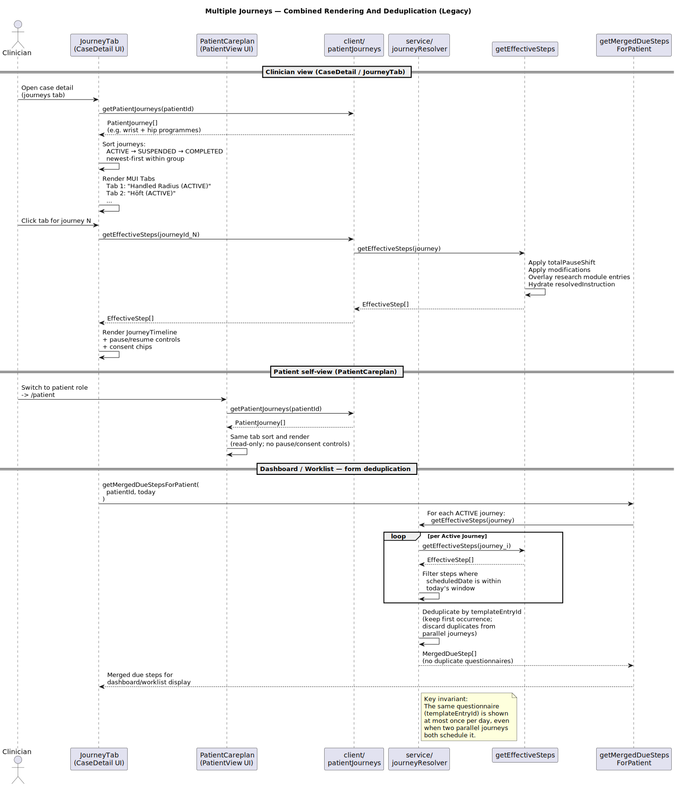

**Patient Journey — Concurrency, Entries and Effective Steps**

Concept

- A `PatientJourney` represents a configured series of follow-ups for a patient anchored at `startDate`.
- A patient can have many `PatientJourney` records simultaneously (e.g., overlapping studies, long-term vs short-term care plans).
- The `startDate` can be any clinically relevant anchor: registration date, surgery date, injury date, etc. It is set at journey assignment and can be reset via `SWITCH_TEMPLATE` with `newStartDate`.

Journey entries

- Each `JourneyTemplateEntry` defines:
  - `offsetDays`: days from journey `startDate` when the entry becomes active
  - `windowDays`: the allowed window for the follow-up
  - `scoreAliases`: a map of alias names to score paths used by policies and templates

- `scoreAliasLabels`: human-readable labels for aliased scores
- `dashboardCategory`: which queue the step maps to (Acute/Subacute/Control)
- `templateId`: optional questionnaire template; omitted for instruction-only steps
- `instructionText`: optional inline instruction content
- `instructionTemplateId`: optional FK to `InstructionTemplate`; if present, overrides `instructionText`

Instruction hydration

- `getEffectiveSteps` hydrates a `resolvedInstruction` string for each step:
  1. If `instructionTemplateId` is set and a matching `InstructionTemplate` exists, use its `content`.
  2. Else if `instructionText` is set, use it directly.
  3. Otherwise, `resolvedInstruction` is `undefined`.
- The `JourneyTimeline` component renders resolved instructions as collapsible panels per step.

Template inheritance (copy-on-derive)

- `deriveJourneyTemplate(parentId, newName)` creates a full deep copy of the parent with:
  - `parentTemplateId` set to the parent's id
  - `derivedAt` set to the current timestamp
  - All entries get new UUIDs (no shared references)
- `computeParentDiff(childId)` compares the child's entries against its parent using `offsetDays + order` as the stable matching key, returning `EntryDiff[]` with types: `ADDED`, `REMOVED`, `CHANGED`.
- `applyParentDiff(childId, entryIds[])` selectively applies diffs to the child and updates `derivedAt`.
- The Journey Editor UI exposes a "Derive" button (creates child) and a "Sync from Parent" button (shows diff checklist and applies selected changes).

Journey switching (SWITCH_TEMPLATE)

- `modifyPatientJourney` with `type: SWITCH_TEMPLATE` changes `journeyTemplateId` to `newTemplateId` and records the `previousTemplateId` in the modification.
- When `newStartDate` is provided, the journey's `startDate` is also updated. The modification records both `previousStartDate` and `newStartDate` so the change is auditable.
- All effective steps recalculate relative to the new start date after switching.

Effective step computation

- `getEffectiveSteps` (see `src/api/service/journeyResolver.ts`) applies modifications, overlays research modules, hydrates instructions, and returns a list of effective follow-ups for display.
- The dashboard uses `getEffectiveSteps` and maps follow-ups to Case rows; Cases are then assigned categories and suggested `nextStep`.

Selection rule (current behavior)

- The UI renders **all journeys** for a patient in MUI `Tabs` sorted ACTIVE → SUSPENDED → COMPLETED (newest first within each group). The old "latest ACTIVE" single-journey selection is retained only for legacy compatibility.
- For the dashboard worklist, `getMergedDueStepsForPatient(patientId, date)` is used instead of per-journey selection — see “Parallel journeys & form deduplication” below.

Journey pause & resume

- `pauseJourney(journeyId)` (service layer) guards `status === 'ACTIVE'`, sets `status: 'SUSPENDED'` and `pausedAt: now()`. **No step dates are written to the store.**
- `resumeJourney(journeyId)` guards `status === 'SUSPENDED'`, computes `elapsedDays = Math.floor((Date.now() − new Date(pausedAt).getTime()) / 86_400_000)`, adds to `totalPausedDays`, clears `pausedAt: null`, sets `status: 'ACTIVE'`.
- `getEffectiveSteps` computes a dynamic shift: `currentPauseDays = status === 'SUSPENDED' && pausedAt ? Math.floor((Date.now() − new Date(pausedAt).getTime()) / 86_400_000) : 0`. The total shift `totalPauseShift = totalPausedDays + currentPauseDays` is added to every step’s scheduled date and recurring step offsets.
- While a journey is suspended the `JourneyTab` shows a paused-days banner and a resume button. All dates in the timeline appear shifted forward, giving clinicians an accurate preview of resumed dates.

Parallel journeys & form deduplication

- `getMergedDueStepsForPatient(patientId, date)` in `src/api/service/journeyResolver.ts` collects all due steps from every ACTIVE journey for the patient, then deduplicates by `templateEntryId`.
- Deduplication is by `templateEntryId` (not by step date): if two parallel journeys both schedule the same questionnaire in an overlapping window only one step is included in the merged result — the questionnaire is never shown twice on the dashboard.
- `JourneyTab` (CaseDetail view) and `PatientCareplan` (patient self-view) render all journeys as MUI `Tabs`. Within each tab, `getEffectiveSteps` is called for that specific journey.

Patient journey status transitions

- `pauseJourney(journeyId)` and `resumeJourney(journeyId)` replace the former `updatePatientJourneyStatus` freeze/unfreeze approach with explicit, pause-aware service functions.
- `assignPatientJourney` always initialises `pausedAt: null, totalPausedDays: 0`.

Scheduling & cases

- Cases may be created from a scheduled follow-up (entry) or from patient-initiated contacts; the mapping is performed when the FormResponse is saved and service logic assigns/creates a `Case` where appropriate.
- There is no automatic background job advancing entries; scheduled follow-ups become visible in the dashboard based on computed dates.

Patient registration flow

- The `/patients` page provides a 3-step registration wizard: patient details → journey assignment (template + reference date) → review & confirm.
- `createPatient` creates the patient record, then `assignPatientJourney` links them to a journey template with the selected start date.
- An "Assign Journey" action is also available on the patient table for existing patients without journeys.

Patient care plan view

- The patient view (`/patient` role=PATIENT) shows a "My Care Plan" section with MUI `Tabs` for all journeys (ACTIVE → SUSPENDED → COMPLETED), each rendering a read-only `JourneyTimeline` for that journey.
- Resolved instructions are visible and expandable within each journey tab.
