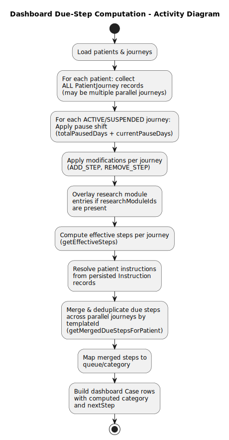
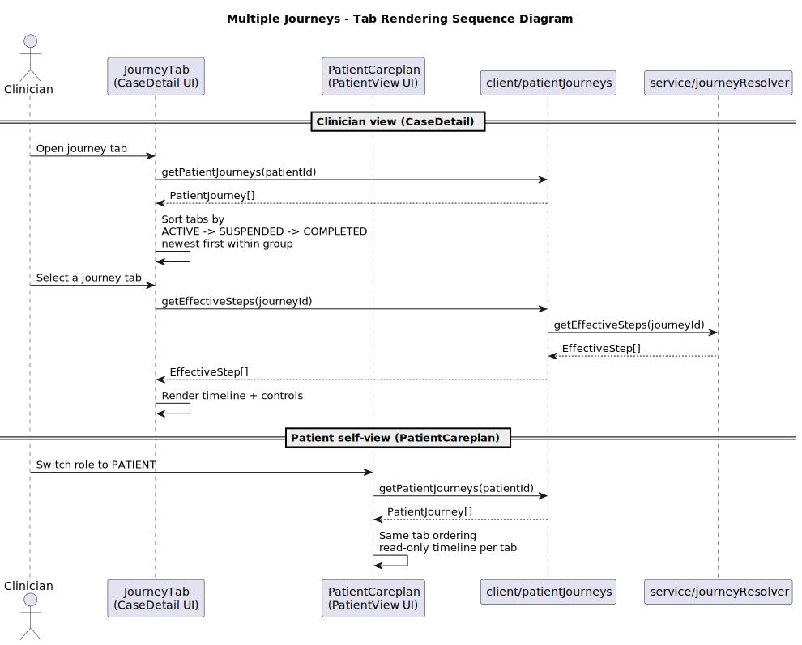
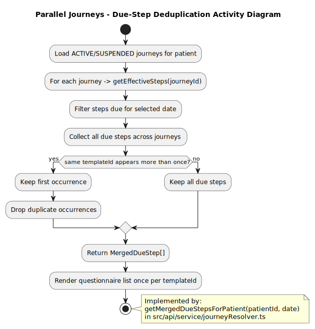
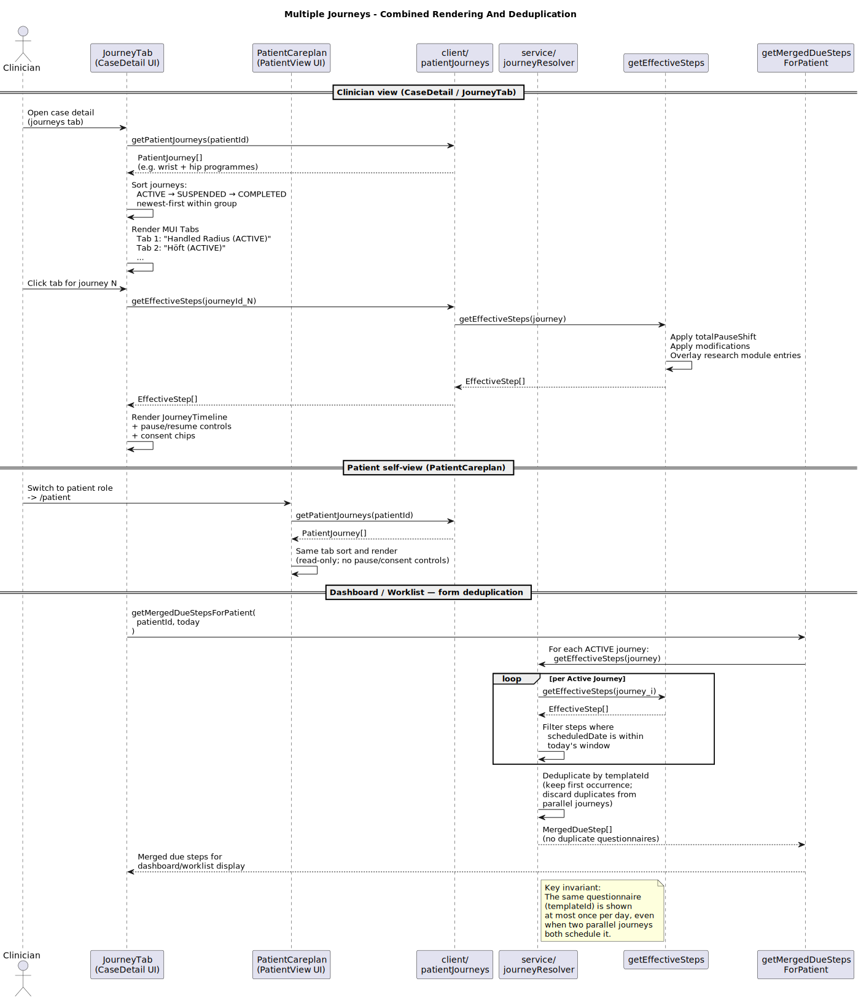
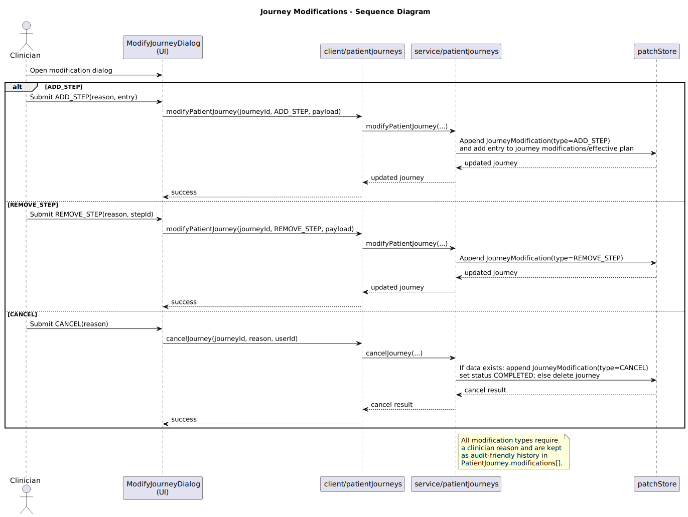

# Patient Journey - Lifecycle and Runtime Behavior

This page is the journey deep dive.
It focuses on journey lifecycle, scheduling, parallelism, deduplication,
pause/resume, modifications, and form coupling.

For architecture navigation, start at `docs/design.md`.

## Lifecycle

Core lifecycle states come from `PatientJourney.status`:

- `ACTIVE`
- `SUSPENDED`
- `COMPLETED`

Source modules:

- `src/api/schemas/journey.ts`
- `src/api/service/patientJourneys.ts`

Phase progression inside an episode uses `startNextPhase(...)`,
which completes the previous journey and creates a new one linked to the same `episodeId`.

## Scheduling and Effective Steps

Effective steps are computed by resolver logic, not persisted as an independent entity.

Key methods:

- `getEffectiveSteps(journeyId)`
- `getMergedDueStepsForPatient(patientId, date)`

Source module:

- `src/api/service/journeyResolver.ts`

## Parallel Journeys and Tabs

Clinician (`JourneyTab`) and patient (`PatientCareplan`) views both render all journeys.
Sorting is deterministic:

- `ACTIVE`
- `SUSPENDED`
- `COMPLETED`

Then newest first inside each status group.

Reference modules:

- `src/components/case/JourneyTab/index.tsx`
- `src/components/patientView/PatientCareplan/main.tsx`

## Deduplication Across Journeys

When multiple journeys produce due forms on the same date window,
`getMergedDueStepsForPatient(...)` deduplicates by questionnaire `templateId`.

Clinical effect: the same questionnaire appears once in dashboard/worklist.

Reference sequence combining tab rendering and deduplication:

## Pause and Resume Semantics

- `pauseJourney(journeyId)` sets `status = SUSPENDED` and stores `pausedAt`.
- `resumeJourney(journeyId)` sets `status = ACTIVE`, clears `pausedAt`, and accumulates elapsed days into `totalPausedDays`.
- Resolver logic uses `totalPausedDays + currentPauseDays` to shift effective dates.

Source modules:

- `src/api/service/patientJourneys.ts`
- `src/api/service/journeyDates.ts`
- `src/api/service/journeyResolver.ts`

## Modifications and Cancellation

Supported modification types:

- `ADD_STEP`
- `REMOVE_STEP`
- `CANCEL`

Cancellation behavior:

- If no data exists for the journey, it may be deleted.
- If data exists, it is archived as `COMPLETED` and a `CANCEL` modification is appended.
- Form responses are retained.

Source module:

- `src/api/service/patientJourneys.ts`

## Form Coupling

Journey coupling to forms is represented by optional links on `FormResponse`:

- `patientJourneyId`
- `journeyTemplateEntryId`
- `occurrenceIndex`

These links support recurring completion tracking and policy scope construction.

Source modules:

- `src/api/schemas/forms.ts`
- `src/api/service/forms.ts`
- `src/api/service/journeyResolver.ts`
