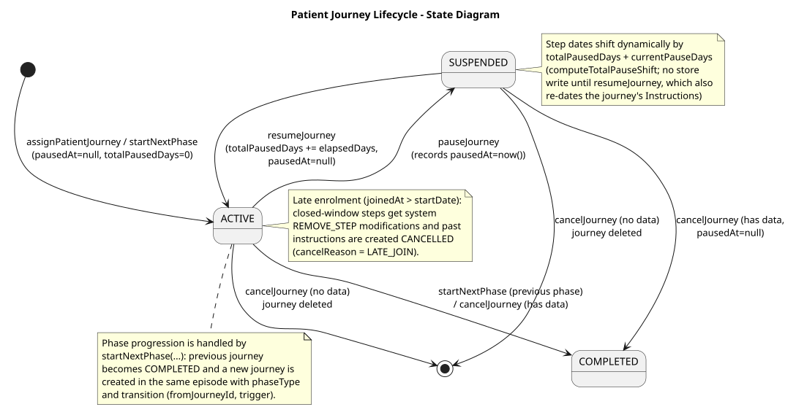
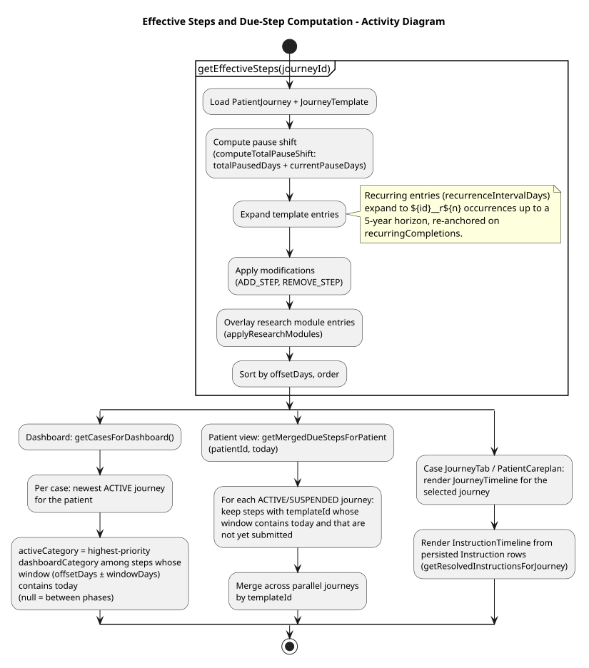
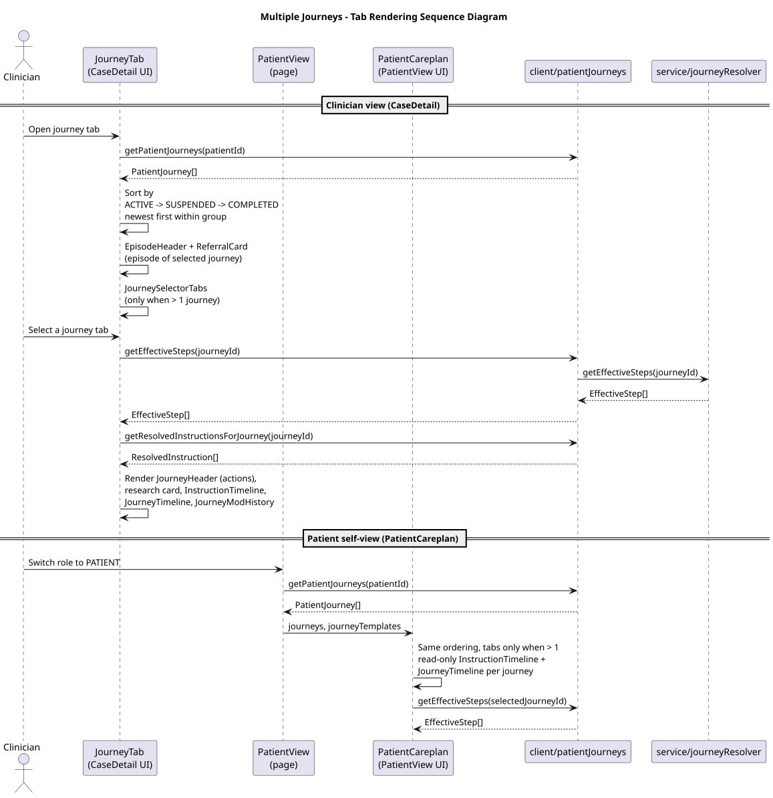
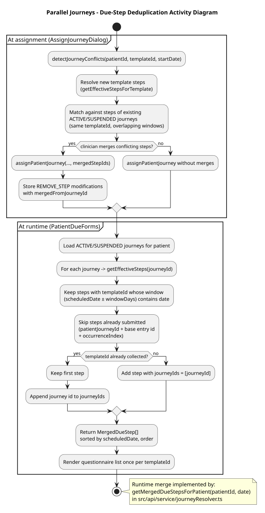
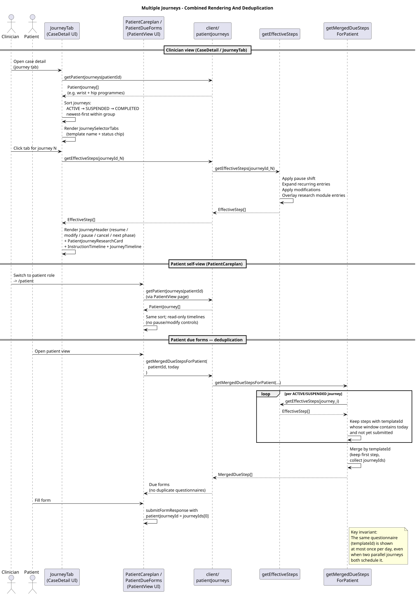
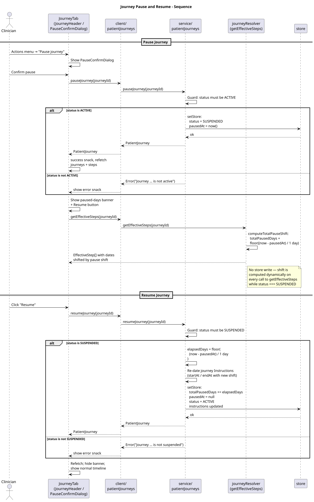
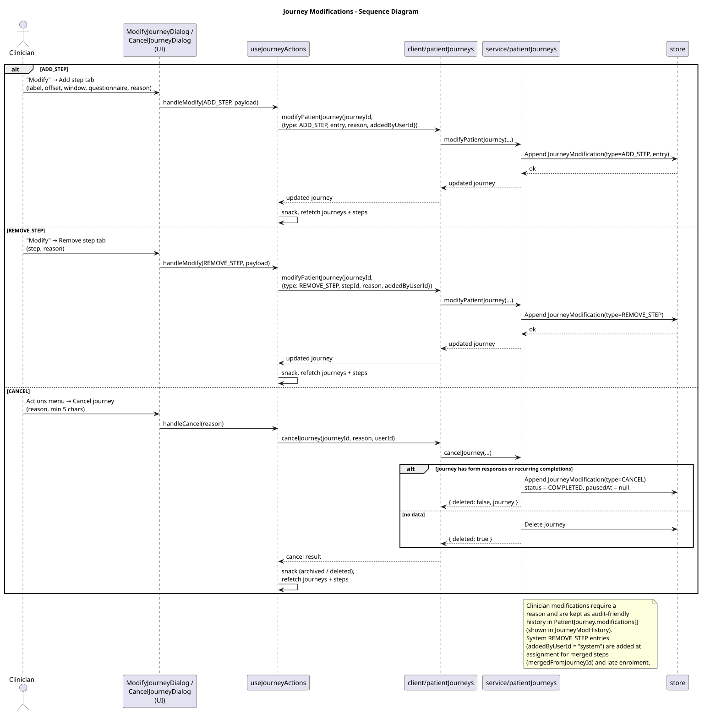

# Patient Journey - Lifecycle and Runtime Behavior

This page is the journey deep dive.
It focuses on journey lifecycle, scheduling, parallelism, deduplication,
pause/resume, modifications, and form coupling.

For architecture navigation, start at `docs/design.md`.

## Lifecycle

Core lifecycle states come from `PatientJourney.status`:

- `ACTIVE`
- `SUSPENDED`
- `COMPLETED`

Source modules:

- `src/api/schemas/journey.ts`
- `src/api/service/patientJourneys.ts`

`assignPatientJourney(...)` creates an `ACTIVE` journey and instantiates `Instruction` rows
from the template's `instructions[]`. When `joinedAt` is after `startDate` (late enrolment),
steps whose window already closed get system `REMOVE_STEP` modifications and
instructions whose end already passed are created as `CANCELLED` (`cancelReason = LATE_JOIN`).

Phase progression inside an episode uses `startNextPhase(...)`,
which completes the previous journey and creates a new one linked to the same `episodeId`,
recording `phaseType` and a `transition` (`fromJourneyId`, trigger type, user, note).

An `EpisodeOfCare` may carry an incoming `referral` (referrer, reason, diagnoses).
Diagnoses are set via `setReferralDiagnoses(...)`, simulating an "uthopp" context launch
from the journal system (`src/api/service/episodes.ts`). A referral episode can exist
before any journey is assigned; `JourneyTab` then shows `EpisodeHeader` and `ReferralCard` only.

## Template Groups and Phases

`JourneyTemplate` has optional `group` and `phaseOrder`.
Templates in the same group that have a `phaseOrder` form a multi-phase care pathway
(for example referral → waiting list → post-op).
Grouping is display/authoring metadata only; runtime phase progression still goes through `startNextPhase(...)`.

The journey editor ("Resmallar" tab, `JourneyTemplatesTab`) groups templates with
`groupTemplates(...)` / `resolveGroup(...)` (explicit `group`, else the parent template's group,
else the name prefix before `—`) and supports full-text search via `findSearchHit(...)`.
The selected template is shown by `TemplateDetail` with `TemplateTimeline`, phase chips,
and `StepList` (instructions attached inline to the step they start after).
Steps are created/edited in `EntryEditorDrawer`.

Reference modules:

- `src/components/journey/editor/JourneyTemplatesTab/templateBrowser.ts`
- `src/components/journey/editor/JourneyTemplatesTab/Content.tsx`
- `src/components/journey/editor/EntryEditorDrawer.tsx`

## Scheduling and Effective Steps

Effective steps are computed by resolver logic, not persisted as an independent entity.
`getEffectiveSteps(...)` applies the pause shift, expands recurring entries
(`recurrenceIntervalDays`, ids `${entryId}__r${n}`), applies `ADD_STEP` / `REMOVE_STEP`,
and overlays research module entries (`applyResearchModules`).

Key methods:

- `getEffectiveSteps(journeyId)`
- `getEffectiveStepsForTemplate(templateId, startDate)` (unsaved journey, used for conflict detection)
- `getMergedDueStepsForPatient(patientId, date)`
- `getCasesForDashboard()` (dashboard `activeCategory` from the open step window of the newest `ACTIVE` journey)

Source modules:

- `src/api/service/journeyResolver.ts`
- `src/api/service/journeyResearch.ts`
- `src/api/service/cases.ts`

## Parallel Journeys and Tabs

Clinician (`JourneyTab`) and patient (`PatientCareplan`) views both render all journeys.
Tabs are only shown when a patient has more than one journey.
Sorting is deterministic:

- `ACTIVE`
- `SUSPENDED`
- `COMPLETED`

Then newest first inside each status group.

Reference modules:

- `src/components/case/JourneyTab/index.tsx`
- `src/components/case/JourneyTab/JourneySelectorTabs.tsx`
- `src/components/patientView/PatientCareplan/main.tsx`

## Deduplication Across Journeys

Deduplication happens at two points:

- At assignment: `detectJourneyConflicts(...)` finds new-template steps whose questionnaire and
  due window overlap an existing `ACTIVE`/`SUSPENDED` journey. Steps the clinician chooses to merge
  are passed as `mergedStepIds` to `assignPatientJourney(...)` and stored as `REMOVE_STEP`
  modifications with `mergedFromJourneyId`.
- At runtime: `getMergedDueStepsForPatient(...)` merges due, not-yet-submitted steps by
  questionnaire `templateId` and records all contributing `journeyIds`.

Clinical effect: the same questionnaire appears once in the patient's due-forms list (`PatientDueForms`).
A submission is linked to the first journey in `journeyIds`.

Reference sequence combining tab rendering and deduplication:

## Pause and Resume Semantics

- `pauseJourney(journeyId)` requires `ACTIVE`, sets `status = SUSPENDED` and stores `pausedAt`.
- `resumeJourney(journeyId)` requires `SUSPENDED`, sets `status = ACTIVE`, clears `pausedAt`,
  accumulates elapsed days into `totalPausedDays`, and re-computes `startAt`/`endAt` on the journey's `Instruction` rows.
- `computeTotalPauseShift(...)` uses `totalPausedDays + currentPauseDays` to shift effective dates.

Source modules:

- `src/api/service/patientJourneys.ts`
- `src/api/service/journeyDates.ts`
- `src/api/service/journeyResolver.ts`

## Modifications and Cancellation

Supported modification types:

- `ADD_STEP`
- `REMOVE_STEP`
- `CANCEL`

`ADD_STEP` / `REMOVE_STEP` are submitted from `ModifyJourneyDialog` via `modifyPatientJourney(...)`.
Cancellation is started from the `JourneyHeader` actions menu (`CancelJourneyDialog`) and calls `cancelJourney(...)`.

Cancellation behavior:

- If no data exists for the journey (no form responses, no recurring completions), it is deleted.
- If data exists, it is archived as `COMPLETED` and a `CANCEL` modification is appended.
- Form responses are retained.

Source module:

- `src/api/service/patientJourneys.ts`

## Form Coupling

Journey coupling to forms is represented by optional links on `FormResponse`:

- `patientJourneyId`
- `journeyTemplateEntryId` (base entry id, without `__r<n>`)
- `occurrenceIndex`

These links support recurring completion tracking (`recurringCompletions`),
already-submitted filtering of due steps, and policy scope construction.

Source modules:

- `src/api/schemas/forms.ts`
- `src/api/service/forms.ts`
- `src/api/service/journeyResolver.ts`
