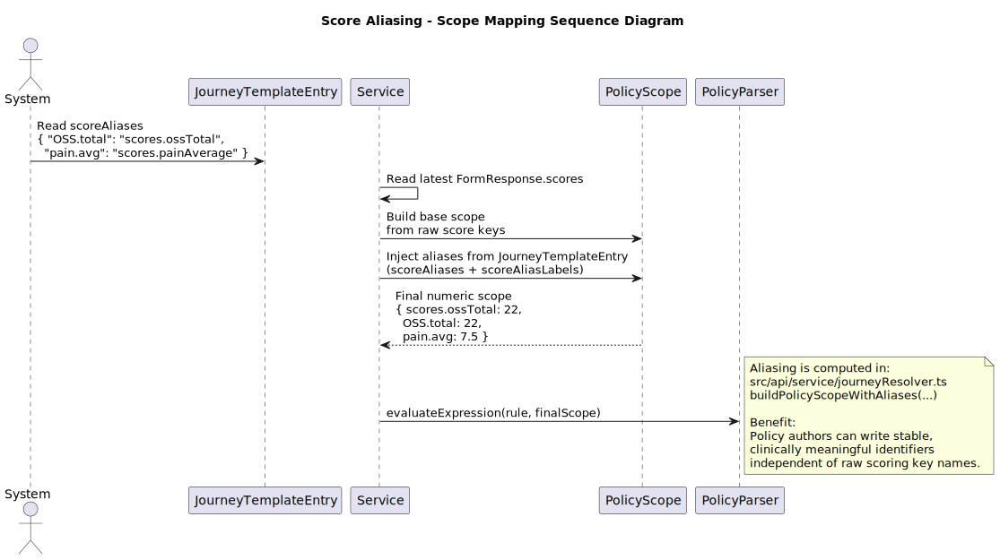
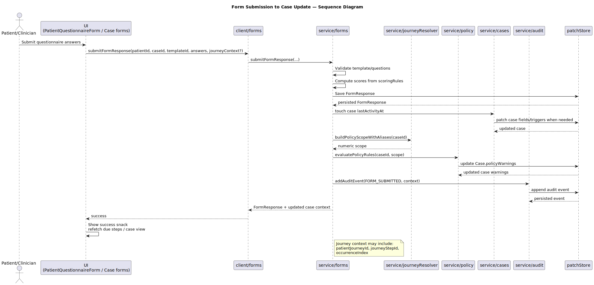

# Policy Evaluation - Flow, Grammar, and Scope

This page documents policy evaluation behavior.
It intentionally excludes broad architecture overview content.

## Evaluation Flow

Policy warnings are produced during case policy re-evaluation.

Primary flow:

1. Collect case form responses.
2. Build policy scope with alias support.
3. Evaluate enabled rules for the applicable journey template.
4. Persist `Case.policyWarnings`.

Source modules:

- `src/api/service/policy.ts`
- `src/api/service/journeyResolver.ts`

## Grammar Model

Parser is a handwritten recursive-descent parser.
No `eval()` or dynamic execution is used.

Operator classes supported by parser/tokenizer:

- Arithmetic: `+ - * /`
- Comparison: `== != < <= > >=`
- Logical: `&& ||`

Source modules:

- `src/api/policyParser/tokens.ts`
- `src/api/policyParser/parser.ts`

## Alias-Aware Scope Construction

Alias mapping allows policies to use stable keys even when raw score names differ.
Resolver logic builds a scope from latest relevant responses and journey template aliases.

Source module:

- `src/api/service/journeyResolver.ts`

## Input Coupling From Form Submission

Form submission is the runtime input path into policy evaluation.

Source modules:

- `src/api/service/forms.ts`
- `src/api/service/policy.ts`

## Authoring Guidance

- Prefer aliases with clinical meaning over raw score keys.
- Keep expressions short and composable.
- Handle missing values as non-matching conditions.
- Bind policy rules to relevant `journeyTemplateId`.
