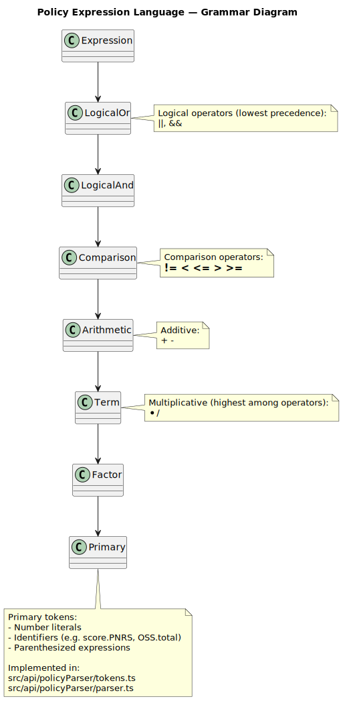
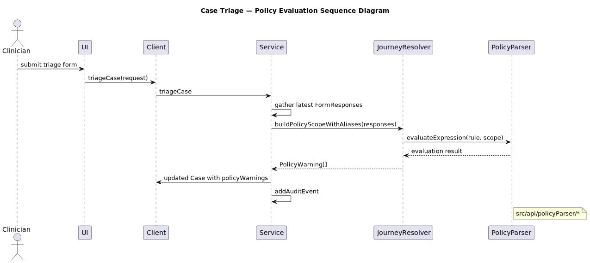

**Policy — Expression Language and Evaluation**

Overview

- Policies are user-editable rules that evaluate to boolean. They are safe: implemented by a tokenizer + recursive-descent parser. No eval.
- Location: `src/api/policyParser/` and `src/api/service/policy.ts`.

Grammar (summary)

- Primary: numeric constants (e.g. 42, 3.14), identifiers (OSS.total, PNRS_1), parenthesis.
- Operators: `*` `/` `+` `-` (arithmetic), comparisons `== != < <= > >=`, logical `&&` `||`.
- Example rule: `(PNRS_1 + PNRS_2) / 2 > 5 && OSS.total < 30`

Scope & identifiers

- The evaluation scope is a flat map of identifier → number produced by `buildPolicyScope`.
- Scores from journeys can be aliased via `scoreAliases` and are injected into the scope (see `journeyResolver.buildPolicyScopeWithAliases`).
- Unknown identifiers evaluate to `NaN` and render the rule as non-matching (the parser never executes arbitrary code).

Rule metadata

- Each rule has `id`, `name`, `expression`, `severity` (LOW, MEDIUM, HIGH), `enabled`.

Evaluation flow

1. Gather latest relevant `FormResponse`s for the case.
2. Compute scores via `computeScores` (scoring rules on questionnaire templates).
3. Build the numeric scope including aliased names.
4. For each enabled policy rule: `evaluateExpression(expression, scope)` → boolean + resolvedVars.
5. If true, create a `PolicyWarning` entry attached to the `Case` with `resolvedVars` for explanation.

Authoring guidance

- Prefer explicit aliasing to create stable identifiers: define `scoreAliases` in the JourneyTemplateEntry (e.g. `OSS.total` → `OSS_total`) and use that alias in rules.
- Keep rules simple and test with sample cases in the Policy Editor UI.

Files of interest

- `src/api/policyParser/tokens.ts` — tokenizer
- `src/api/policyParser/parser.ts` — parser + evaluator
- `src/api/service/policy.ts` — CRUD + re-evaluation
