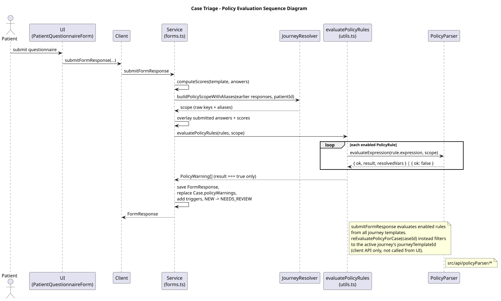
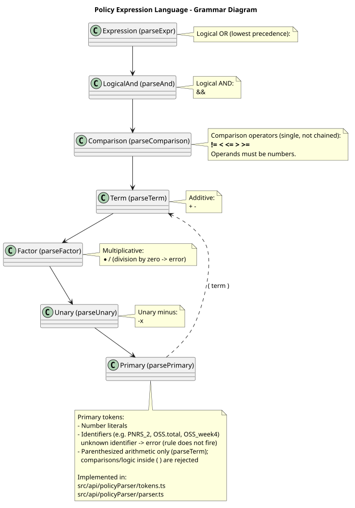
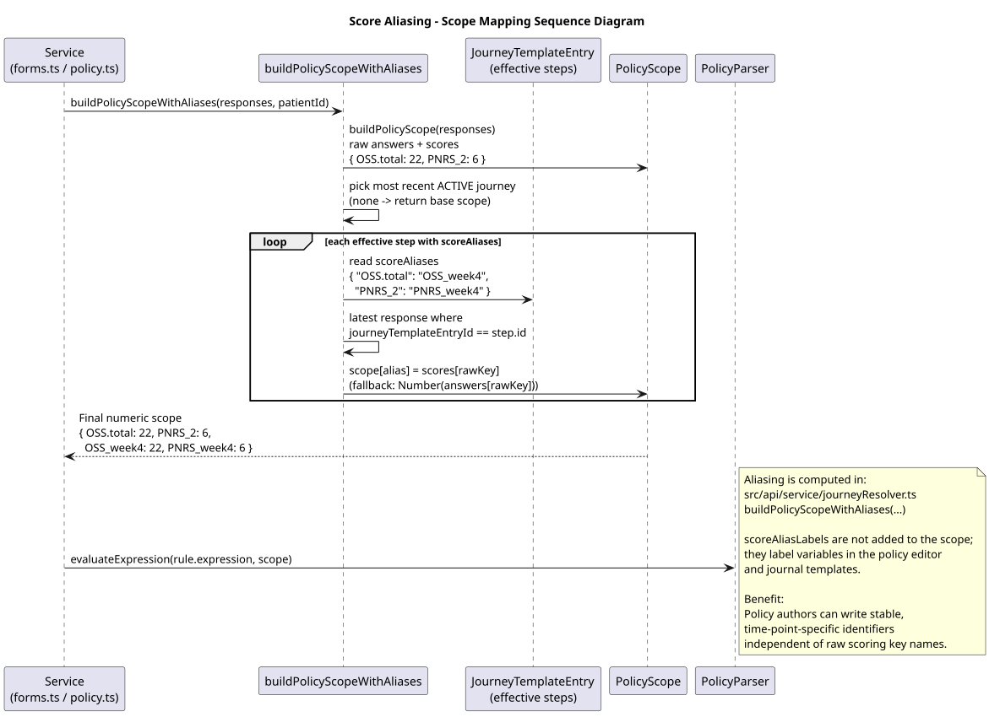
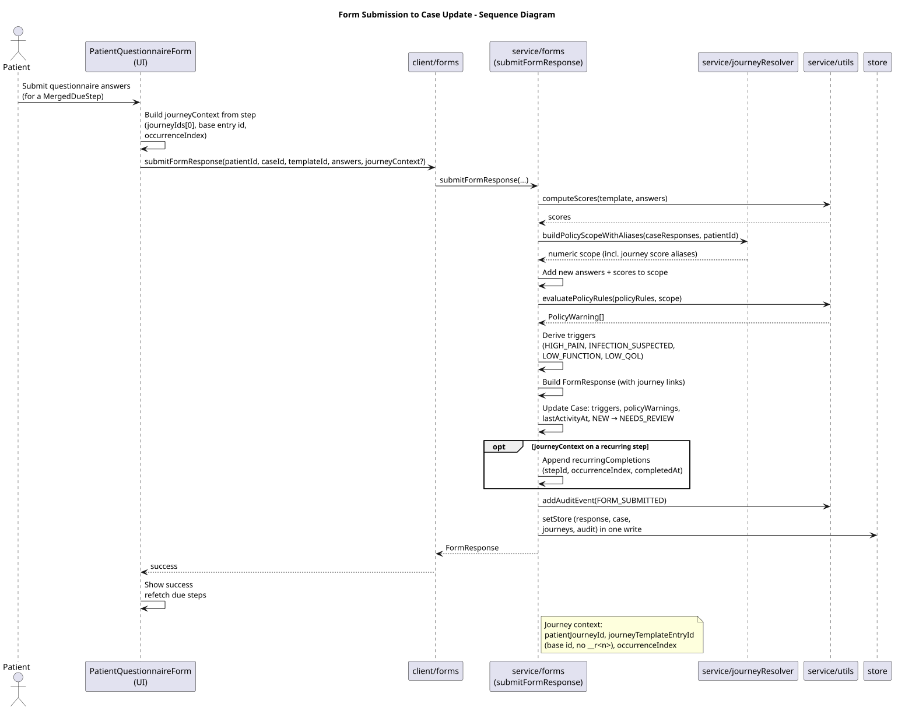

# Policy Evaluation - Flow, Grammar, and Scope

This page documents policy evaluation behavior.
It intentionally excludes broad architecture overview content.

## Evaluation Flow

Policy warnings are produced when a patient submits a questionnaire (`submitFormResponse`).
Triage does not evaluate policies; it only reads the stored warnings.

Primary flow (form submission):

1. Build policy scope with alias support from the case's earlier form responses.
2. Overlay the submitted answers and computed scores under their raw keys.
3. Evaluate all enabled rules (see note below).
4. Persist `Case.policyWarnings` (replaced, not merged) together with the new `FormResponse`.

Each `PolicyWarning` stores `ruleId`, `ruleName`, `severity`, `expression` and
`triggeredValues` (the variables the parser resolved). A rule only produces a warning
when the expression evaluates to exactly `true`; parse errors, unknown variables and
numeric results are silently non-matching.

`reEvaluatePolicyForCase(caseId)` recomputes warnings from all stored responses and
restricts rules to the `journeyTemplateId` of the patient's most recent ACTIVE journey
(no active journey → no warnings). It is exposed via the API client but is not
currently called from the UI.

> Note: `submitFormResponse` evaluates enabled rules from **all** journey templates, not
> only the patient's active template. Only `reEvaluatePolicyForCase` applies the template filter.

Source modules:

- `src/api/service/forms.ts`
- `src/api/service/policy.ts`
- `src/api/service/utils.ts` (`evaluatePolicyRules`, `buildPolicyScope`)
- `src/api/service/journeyResolver.ts`

## Grammar Model

Parser is a handwritten recursive-descent parser that evaluates while parsing.
No `eval()` or dynamic execution is used.

Operator classes supported by parser/tokenizer (lowest to highest precedence):

- Logical: `||`, then `&&`
- Comparison: `== != < <= > >=` (at most one per operand pair; not chainable)
- Additive: `+ -`
- Multiplicative: `* /` (division by zero is an error)
- Unary minus: `-x`

Primaries are number literals, identifiers (`[A-Za-z_][A-Za-z0-9_.]*`, e.g. `PNRS_2`,
`OSS.total`, `OSS_week4`) and parenthesised arithmetic.

Known limitations:

- Parentheses only wrap arithmetic; `(a > 1) || b > 2` is rejected.
- Trailing tokens after a complete expression are ignored rather than rejected.

`validateExpression` parses against a scope where every identifier resolves to `0`,
so it checks syntax only. The policy editor runs it via the zod form schema
(`src/components/policy/policyRuleForm.ts`).

Source modules:

- `src/api/policyParser/tokens.ts`
- `src/api/policyParser/parser.ts`
- `src/api/policyParser/index.ts`

## Alias-Aware Scope Construction

Alias mapping allows policies to use stable, time-point-specific keys even when the same
questionnaire is used at several steps.

1. Base scope: every answer (as number) and score from the case's responses, keyed by
   raw name; later responses overwrite earlier ones.
2. For the patient's most recent ACTIVE journey, each effective step with
   `scoreAliases` (`{ rawKey: alias }`, e.g. `{ "OSS.total": "OSS_week4" }`) takes the
   latest response linked to that step (`journeyTemplateEntryId`) and sets
   `scope[alias]` from `scores[rawKey]`, falling back to `answers[rawKey]`.

`scoreAliasLabels` are not part of the scope; they label aliases in the policy editor's
variable list and in journal templates.

Source module:

- `src/api/service/journeyResolver.ts` (`buildPolicyScopeWithAliases`)

## Input Coupling From Form Submission

Form submission is the runtime input path into policy evaluation.

Source modules:

- `src/api/service/forms.ts`
- `src/api/service/policy.ts`

## Policy Editor

The Triagepolicyer page (`/policy`, NURSE and DOCTOR) scopes rules to one journey
template via a template picker (defaults to the first template). Rules are listed in a
table with severity tag, enable/disable switch and an edit/delete menu. The rule dialog
validates the expression and suggests alias variables from the selected template.
New and edited rules are saved as enabled.

Source modules:

- `src/pages/PolicyEditor.tsx`
- `src/components/policy/`

## Authoring Guidance

- Prefer aliases with clinical meaning over raw score keys.
- Keep expressions short and composable.
- Missing values are non-matching: an unknown identifier makes the rule not fire.
- Bind policy rules to relevant `journeyTemplateId`.
