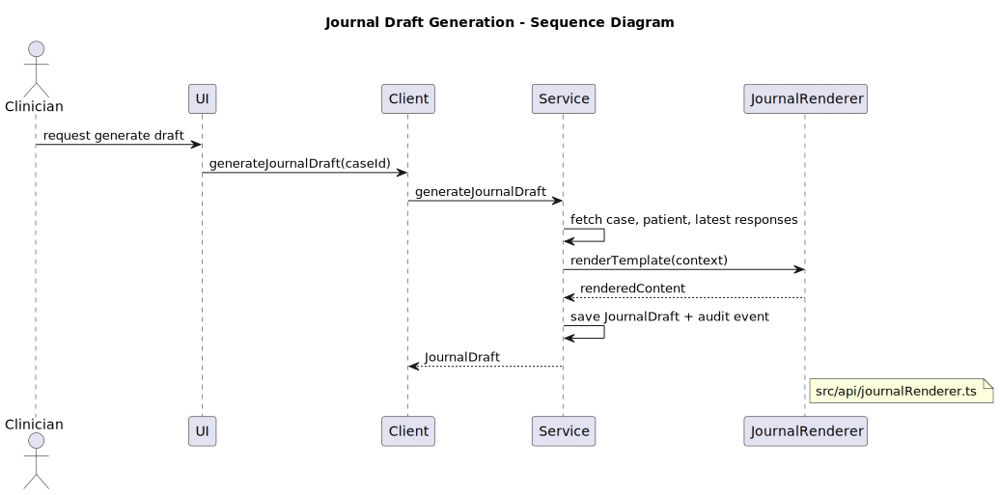

# Journal Templating - Renderer Scope and Safety

This page documents the journal renderer behavior only.
It does not cover generic architecture or policy flow.

## Rendering Flow

Source modules:

- `src/api/service/journal.ts`
- `src/api/journalRenderer.ts`

## Allowed Token Scope

Renderer supports whitelisted tokens, including:

- `{{patient.displayName}}`
- `{{patient.dateOfBirth}}`
- `{{case.category}}`
- `{{case.status}}`
- `{{policyWarnings.list}}`
- `{{triage.nextStep}}`
- `{{score.ALIAS}}`
- `{{label.ALIAS}}`

Whitelists are enforced in `src/api/journalRenderer.ts`.

## Conditionals

Supported form:

- `{{#if triggers.FLAG}}...{{/if}}`

Only whitelisted trigger flags are valid.
No nested expressions or helper execution is allowed.

## Safety Constraints

- No `eval()`.
- No user-defined helper execution.
- No arbitrary expression evaluation.
- Unknown tokens resolve to validation markers in output.

## Authoring Notes

- Keep templates deterministic and auditable.
- Prefer alias-based score references to raw keys.
- Add new tokens by updating the whitelist in `journalRenderer.ts`.
- Keep templates and language output aligned with clinical terminology.
