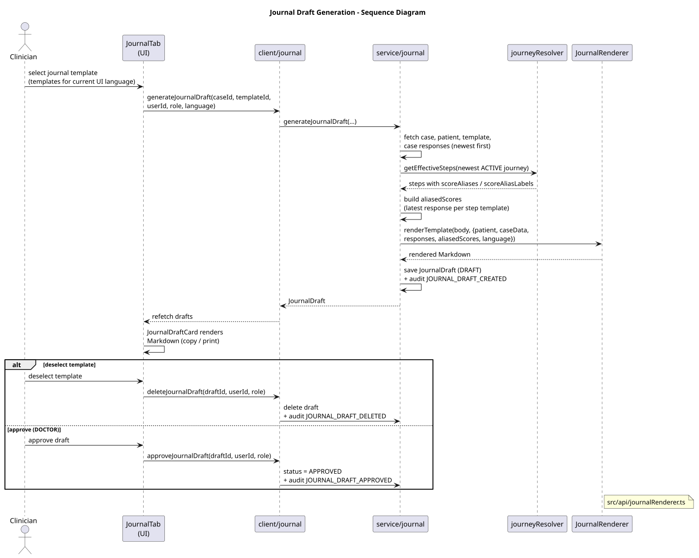

# Journal Templating - Renderer Scope and Safety

This page documents the journal renderer behavior only.
It does not cover generic architecture or policy flow.

## Rendering Flow

In `JournalTab`, the clinician toggles journal templates for the current UI language.
Selecting a template calls `generateJournalDraft(caseId, templateId, userId, role, language)`;
deselecting it calls `deleteJournalDraft(...)`. A `DOCTOR` can approve a draft with `approveJournalDraft(...)`.
Each action writes an audit event (`JOURNAL_DRAFT_CREATED`, `JOURNAL_DRAFT_DELETED`, `JOURNAL_DRAFT_APPROVED`).

Generated content is Markdown and is displayed with `react-markdown` in `JournalDraftCard` (copy and print supported).

Source modules:

- `src/api/service/journal.ts`
- `src/api/journalRenderer.ts`
- `src/components/case/JournalTab/index.tsx`
- `src/components/case/JournalDraftCard.tsx`

## Allowed Token Scope

Renderer supports whitelisted static tokens:

- `{{patient.displayName}}`, `{{patient.dateOfBirth}}`
- `{{case.category}}`, `{{case.status}}`
- `{{scores.PNRS_1}}`, `{{scores.PNRS_2}}`, `{{scores.PNRS_NIGHT}}`, `{{scores.OSS.total}}`, `{{scores.EQ5D.index}}`, `{{scores.EQ_VAS}}`
- `{{policyWarnings.list}}`
- `{{triage.nextStep}}`, `{{triage.deadline}}`, `{{triage.internalNote}}`, `{{triage.patientMessage}}`

And dynamic alias tokens resolved from the newest `ACTIVE` journey's step `scoreAliases` / `scoreAliasLabels`:

- `{{score.ALIAS}}`
- `{{label.ALIAS}}`

`scores.*` values take the most recent value across all case responses.
Enum values (category, status, severity, next step) are translated using the template's `language`
(falling back to the requested language, default `sv`).

Whitelists are enforced in `src/api/journalRenderer.ts`.

## Conditionals

Supported form:

- `{{#if triggers.FLAG}}...{{/if}}`

Only whitelisted trigger flags are valid (`HIGH_PAIN`, `INFECTION_SUSPECTED`, `NO_RESPONSE`,
`NOT_OPENED`, `LOW_FUNCTION`, `LOW_QOL`, `SEEK_CONTACT`, `ABNORMAL_ANSWER`).
No nested expressions or helper execution is allowed.

## Safety Constraints

- No `eval()`.
- No user-defined helper execution.
- No arbitrary expression evaluation.
- Unknown tokens render as `[Okänd variabel: TOKEN]`; unknown flags as `[Ogiltig flag: FLAG]`.

## Authoring Notes

- Keep templates deterministic and auditable.
- Prefer alias-based score references to raw keys.
- Add new tokens by updating the whitelist in `journalRenderer.ts`.
- Keep templates and language output aligned with clinical terminology.
